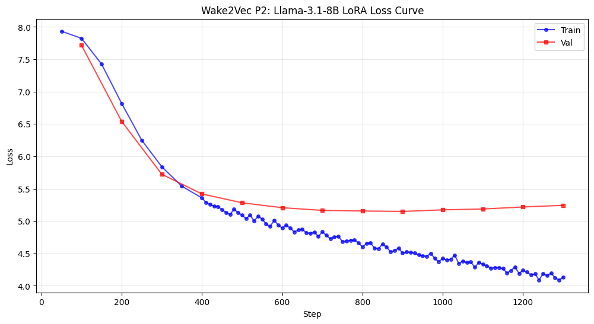

# wake2vec: Llama 3.1-8B P2 Results

## Final Numbers

| Metric | Value |
|--------|-------|
| Model | meta-llama/Llama-3.1-8B (4-bit NF4) |
| Phase | P2 (LoRA behavioural adaptation) |
| P1 source | step 1200 (best val 11.3603, the U-curve minimum) |
| Steps | 1300 (cut after the limb was characterised) |
| **Best val** | **5.1486 (step 900; the run floored across 800-1000)** |
| Best-val delta from P1 | **-6.21** |
| Depth below the 3B's capacity wall | **0.181** |
| Final val (step 1300) | 5.242857 |
| Final train (step 1300) | 4.131872 |
| Final train-val gap | 1.111 |
| LoRA rank | 8, alpha 16, dropout 0.1 |
| LoRA targets | q_proj, k_proj, v_proj, gate_proj, up_proj, down_proj |
| Embeddings | Frozen (from P1 step 1200), drift verified 1.000000 |
| SEQ_LEN | 512 |
| Effective batch | 16 (1 x 16) |
| Wake injection | 44,195 tokens (128,256 base, 172,451 total), compositional 1.0x init |

## The curve

| Step | Train | Val | Note |
|------|-------|-----|------|
| 100 | n/a | 7.72 | |
| 200 | n/a | 6.54 | |
| 300 | n/a | 5.72 | |
| 500 | n/a | 5.282 | **crosses below the 3B's 5.3326** |
| 700 | 4.833 | 5.164 | 0.166 below the wall |
| 800 | 4.598 | 5.155 | 0.175 below |
| 900 | 4.504 | **5.1486** | **best val**, 0.181 below, gap 0.645 |
| 1000 | 4.421 | 5.173 | turn signal: val +0.024 |
| 1100 | 4.332 | 5.186 | turn confirmed: val +0.013, gap 0.854 |
| 1200 | 4.238 | 5.217 | val +0.031, gap 0.979 |
| 1300 | 4.132 | 5.243 | cut. val +0.026, gap 1.111, still 0.090 under the wall |

Three important properties:

1. Val reads 5.21, 5.17, 5.16, 5.15, 5.17 across steps 600 to 1000: a 400-step plateau varying by about 0.06. For comparison, Mistral cuts a sharp vertex and climbs away at a constant +0.069, while the 8B sits in a long flat basin and lifts out of it at a third that rate.

2. A turn confirmed on the strictest criterion. Two consecutive val rises (+0.024, +0.013) against a train that fell monotonically throughout (4.833, 4.598, 4.504, 4.421, 4.332, 4.238, 4.132), with no reversal anywhere in the run. 

3. A bounded ascending limb. Four rises of +0.024, +0.013, +0.031, +0.026, mean +0.0236 per hundred steps, all inside a +0.013 to +0.031 band. 

### On locating the minimum

Val across 800/900/1000 reads 5.155, 5.1486, 5.173, a span of 0.024, at or near the noise floor of a single evaluation on this model's small held-out set (SEQ_LEN 512 on the 128K tokenizer puts it near ninety blocks, on the Llama-family precedent; 
fill the exact count from the run log). The run floored across 800-1000 and step 900 was taken as the source. 

### The crossing

The 8B's advantage over the 3B is spent when the limb re-crosses 5.3326. From 5.242857 that is 0.0897:

| rate assumption | steps to cross | crossing near |
|---|---|---|
| fastest observed (+0.031) | ~290 | 1590 |
| mean (+0.0236) | ~380 | **1680** |
| slowest observed (+0.013) | ~690 | 1990 |

Reported as a prediction with its uncertainty. The crossing is a landmark about the 3B's number rather than the 8B's, adds no mechanism, and 400 further steps would have bought a value already in this table.

## scale result

The low-rank adaptation ceiling is scale-dependent. The 3B's P2 reached a fixed value of 5.33 within 100 steps and did not move across six consecutive evaluations (total movement 0.001046). The 8B, holding vocabulary (128K) and architecture constant 
and varying only scale, does not reproduce it: it descends through that value at step 500 and floors 0.181 beneath it.

Because the 3B and 8B share the exact tokenizer, their validation token mixtures are identical and the values are directly comparable. 

## Embedding Analysis

Embeddings are frozen in P2, so this characterises the P1 step-1200 matrix that P2 routed.

### Drift (verification)

| | Cosine (mean) | Std |
|---|---|---|
| Wake tokens | **1.000000** | 0.000000 |

Verified on 5,000 sampled rows. 

### Norms

| | Mean | Std | n |
|---|---|---|---|
| Base | 0.6741 | 0.0843 | 128,256 |
| Wake | 0.7421 | 0.0260 | 44,195 |

Welch t = -255.70, p ≈ 0; Cohen's d = -1.0900; Wake/base ratio 1.10.

Note that the P1 analysis ran on the step-3000 matrix while P2 froze step-1200. The difference is a free within-model measurement of what P1's overfitting phase did to the Wake norms: d from -1.09 to -1.25, ratio 1.10 to 1.12. 
Base mean is 0.6741 here against 0.674 in P1, confirming the gradient masking held exactly across both phases. Wake norms also have a much tighter spread than base (0.0260 against 0.0843), the signature of a common initialisation radius that training has not dispersed.

### Isotropy (Mu et al. 2018, partition function ratio)

| Population | Isotropy | Mean cos |
|---|---|---|
| All | 0.993665 | 0.0000 |
| Base | 0.989630 | 0.0000 |
| **Wake** | **0.998453** | -0.0000 |

The Wake region reaches the 0.998 attractor again, the sixth configuration to do so, and is more isotropic than the base model's own pretrained vocabulary. Since this model uses the set's only compositional 1.0x initialisation, which starts 
base-correlated rather than on a distinct shell, this is the strongest available form of the claim that 0.998 isotropy is an attractor of the training dynamics rather than an artifact of the initialisation.

### Pairwise cosine similarity

| Pair | Mean |
|---|---|
| base-base | 0.0162 |
| new-new | 0.0076 |
| **base-new** | **0.0009** |

The Wake region is half as self-similar as the base vocabulary and essentially orthogonal to it.

### Nearest neighbours (Wake to base)

Every sampled Wake token's nearest base neighbours are code fragments, rare-script tokens, or byte-fallback runs, at cosine 0.056 to 0.083:

| Wake token | nearest base neighbours |
|---|---|
| `générations` | `artisanlib` (0.083), `itizen` (0.082), `âĸįâĸįâĸį...` (0.079) |
| `grandmère` | `_critical` (0.077), `ĠCorpor` (0.068), `_command` (0.066) |
| `primamère` | `Scenario` (0.073), `Statistic` (0.071), `BASE` (0.070) |
| `o'daffy` | `propri` (0.065), `Ġtrousers` (0.062), `.findOne` (0.060) |
| `dunelli` | `ĠGuild` (0.079), `_ratings` (0.077), `Classifier` (0.070) |

No neighbour is close to any Wake token. At a maximum of 0.083 there is no semantic neighbourhood at all; the argmax over cosine simply returns whichever base rows are themselves quasi-orthogonal, that is, the vocabulary's undertrained entries, 
which in Llama 3.1 are code and rare-script fragments that remained near their initialisation.

### Intrinsic dimensionality (PCA)

| | 90% variance |
|---|---|
| Base (30,000-row sample) | **>100 PCs** (cap) |
| Wake | **>100 PCs** (cap) |

Both eigenspectra are flat enough that 100 components do not reach 90% variance, consistent with the isotropy figures. (The raw `searchsorted(...)+1` returns 101, which is the saturation value, not a measurement.)

### The synthesis: norm-integrated, direction-orthogonal

- Norm-integrated. Compositional 1.0x placed the Wake rows at base radius (d = -1.09, ratio 1.10), rather than on the distinct outer shell that spherical 1.5x produces (d ≈ -7).
- Direction-orthogonal. Base-new pairwise cosine is 0.0009 and the best nearest neighbour is 0.083. There is no directional relationship to the base vocabulary at all.

Norm parity is what explains the P1 code leak: equal radius means base tokens compete on equal footing in the logit softmax, so base-register material can win. Directional orthogonality explains why the neighbourhood structure is meaningless. 
The 3B, on spherical 1.5x with Wake on a higher-norm shell, did not leak base-register code.

## Cross-model P2 comparison

| Model | Vocab | Best val | Step | Morphology |
|---|---|---|---|---|
| Mistral 7B | 32K | 4.705 | 600 | gentle-monotonic turn, limb linear then steepening |
| **Llama 3.1-8B** | **128K** | **5.1486** | **900** | **soft-floor-then-turn, wide basin, bounded shallow limb** |
| Llama 3.2-3B | 128K | 5.33 | 100 | capacity wall, six identical evals |
| Qwen 2.5-14B | 152K | 5.9209 | 1600 | fits-crawl, no confirmed turn |
| Phi-3.5 | 32K | ~8.36 (flooring) | n/a | asymptotic approach to a high floor |

Absolute values compare only within a shared tokenizer. The 8B and 3B share theirs exactly; that pair carries the scale result. Mistral and Phi share a 32K vocabulary at matched 58% Wake share; that pair carries the pretraining-data result. 
Across differing vocabularies the comparison is of trajectory shape.

## The generation result

Full battery in `P2_generation_8B.md`. Three findings.

1. The over-deformation case is corrected. P1 failed suspension by over-deforming: invention so dense that meaning was abolished. P2 returns the syntax without thinning the invention. Paired with Mistral, which entered P2 from dissolution and also
emerged in suspension, this gives two opposite P1 failure modes corrected by the same intervention. Since embeddings are frozen with drift exactly 1.000000, the effect is attributable to routing alone.

2. The code-register leak closed. No code identifier, no CJK, Cyrillic or Arabic, no byte-fallback runs at any temperature, where P1 leaked all of them. Sampling settings were verified identical to the 8B's own P1 battery before the run,
so truncation cannot account for it. 

3. The output is roughly seventy percent retrieval of installed Wake vocabulary. Distinctive forms grepped against `wake_lexicon.txt`: 42 confirmed lexicon entries against 16 inventions, and nearly every confirmed token occurs only once or twice
in the whole corpus (`cettehis`, `sengentide`, `athemisthued`, `coolpose`, `rooksacht`, `eddaying`). Hapax legomena from a single text, installed as embedding rows in P1, retrieved and placed in syntax by P2. `cettehis` recurs across two independent
samples, so the rows are consistently addressable.

### The within-family series

The vocabulary-matched comparison runs through the Llama family and TinyLlama, where lexicon, corpus and protocol are held constant across an order of magnitude of scale.

| Model | Vocab | Wake share | Generation character |
|---|---|---|---|
| TinyLlama 1.1B (P3b) | 32K | ~58% | suspension; genuine Wake proper nouns and multilingual material |
| Llama 3.2-1B (P2) | 128K | ~26% | sustained Wake prose inside a Victorian epistolary frame |
| Llama 3.2-3B (P2) | 128K | ~26% | nine registers across the battery, no sustained Wake prose |
| **Llama 3.1-8B (P2)** | **128K** | **~26%** | **suspension, ~70% of distinctive forms verified as retrieved lexicon** |

## Implications for P3

The Wake region sits at 0.998453 isotropy, the attractor value, and higher than the base vocabulary's 0.9896. The standing structural diagnosis for the geometric null is that near-perfect isotropy leaves no pre-existing structure for the 
auxiliary losses to amplify, and this configuration is at the attractor rather than below it. A near-orthogonal region with no semantic neighbours in the base vocabulary might have been expected to emit arbitrary strings. Instead it retrieves 
rare Wake tokens accurately and places them in syntax. Whatever makes those rows usable is not visible in the isotropy, the pairwise cosine, or the nearest-neighbour structure; each of those describes the region as featureless. That gap between 
a featureless geometry and competent behaviour is the thing P3's instruments are currently unable to see.
