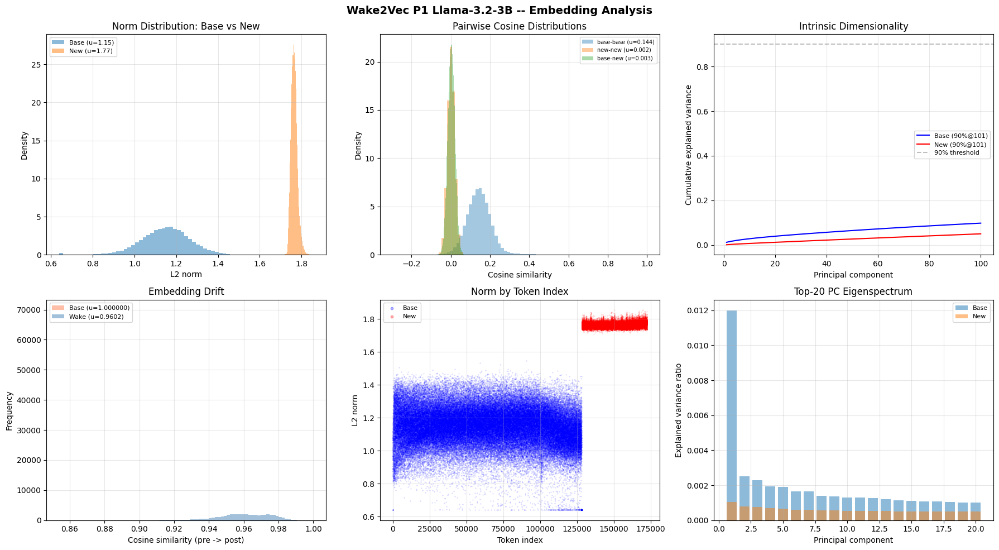

# wake2vec Llama 3.2-3B P1 Results

## Final Numbers

| Metric | Value |
|--------|-------|
| Model | meta-llama/Llama-3.2-3B (4-bit NF4) |
| Phase | P1 (embedding-only fine-tune, gradient masking) |
| Base vocab | 128,256 |
| Wake tokens added | 44,195 |
| Total vocab | 172,451 |
| Steps | 3,000 (23 Colab sessions) |
| Final train | 26.9243 |
| Final val | 7.0867 |
| **Best val** | **6.6847 (step 300)** |
| Optimizer | AdamW |
| LR | 2e-4 |
| Embedding init | Spherical, 1.5x base radius |
| SEQ_LEN | 512 |
| Effective batch | 16 (1 x 16) |
| Trainable params | ~530M (Wake embedding rows only, base frozen via gradient masking) |


## Loss Trajectory

| Step | Train | Val | Session |
|------|-------|-----|---------|
| 100 | 109.19 | 7.01 | 1 |
| 200 | 97.27 | 6.75 | 2 |
| **300** | **87.04** | **6.68** | **best** |
| 400 | 79.07 | 6.70 | 3 |
| 500 | 72.80 | 6.72 | 3 |
| 600 | 67.01 | 6.75 | 4 |
| 700 | 62.09 | 6.77 | 5 |
| 800 | 58.50 | 6.79 | 6 |
| 900 | 54.30 | 6.81 | 8 |
| 1000 | 51.15 | 6.83 | 9 |
| 1100 | 49.36 | 6.83 | 9 |
| 1200 | 46.56 | 6.84 | 10 |
| 1300 | 45.91 | 6.85 | 11 |
| 1400 | 42.99 | 6.89 | 12 |
| 1500 | 44.91 | 6.93 | 12 |
| 1600 | 44.08 | 6.93 | 13 |
| 1700 | 42.54 | 6.96 | 14 |
| 1800 | 41.98 | 6.97 | 14 |
| 1900 | 40.03 | 6.99 | 15 |
| 2000 | 38.58 | 7.00 | 16 |
| 2100 | 36.90 | 7.01 | 16 |
| 2200 | 36.83 | 7.03 | 17 |
| 2300 | 34.99 | 7.04 | 18 |
| 2400 | 33.52 | 7.05 | 19 |
| 2500 | 32.23 | 7.06 | 20 |
| 2600 | 31.59 | 7.07 | 20 |
| 2700 | 29.99 | 7.07 | 21 |
| 2800 | 28.79 | 7.08 | 22 |
| 2900 | 27.58 | 7.08 | 23 |
| **3000** | **26.92** | **7.09** | **complete** |

## The U-curve 

val descended sharply for 300 steps (7.01 → 6.68), then climbed monotonically back to 7.09 over the next 2,700 steps and finished within 0.08 of where she started, having found and then walked away from the optimum.

train, meanwhile, dropped from 109 to 27 which is a 75% decrease, and a classic memorisation signature, but on a P1 embedding-only run there's nothing for the model to memorise *except* the new tokens. the train descent reflects the embeddings settling into the corpus distribution; the val climb reflects those embeddings overspecialising to the training subset.

best checkpoint is step 300. 

### What the U-curve means

P1 is embedding-only. the transformer is frozen; only the 44,195 new Wake token rows receive gradient updates. with a 128K base vocab, most of the lexical patterns the Wake uses are *already* tokenisable through existing subwords, so the new tokens are largely portmanteau-fusions and accented forms that the base vocab couldn't represent atomically.

thus the model has a short ramp to find good positions for these tokens (steps 0–300), and then runs out of meaningful gradient signal. additional steps push the embeddings toward perfect prediction of the training distribution, but the val set's held-out passages don't share the same subword statistics, so val drifts upward.

this is the 128K-vocab signature in extreme form. compare to TinyLlama P1 (32K vocab → 44,500 new tokens, much larger learning surface, monotonic descent throughout) and to Llama 1B P1 (same 128K vocab, smaller body, less capacity to overfit per step with best val at step 1400, milder U-shape). the 3B's deeper transformer means each Wake embedding row has more contextual neighbours to satisfy, and the optimisation finds its local minimum faster, then overshoots.

---

## Embedding Analysis (post-training)



### Norm distributions

| | Mean | Std | n |
|---|------|-----|---|
| Global | 1.3058 | 0.2879 | 172,451 |
| Base | 1.1475 | 0.1163 | 128,256 |
| Wake | 1.7654 | 0.0152 | 44,195 |
| Welch t-test | t=-1857.82, p=0.00 | | |
| Mann-Whitney U | U=0, p=0.00 | | |
| Cohen's d | -7.45 | | |

Wake tokens sit at 1.77 which is significantly above the base distribution mean of 1.15. The Wake norms are tightly clustered (std 0.015) because P1's spherical init placed them all on a single shell, and training kept them near that radius. Cohen's d of -7.45 is massive, highlighting that base and Wake are in completely separate norm distributions.

For context: Llama 1B P1 settled at Wake 1.50 / base 0.99 (Cohen's d -7.81). The 3B's higher absolute norms reflect its larger hidden dimension (3072 vs 2048). base radius scales with √dim, so expected ratio is √(3072/2048) ≈ 1.22. The 1.15/0.99 ratio matches that scaling. The same 1.5x spherical init policy produced the same relative norm gap on both models.

### Embedding drift (pre to post)

| | Cosine sim (mean) | Std | L2 dist (mean) |
|---|---|---|---|
| Base | 1.000000 | 0.000000 | 0.000000 |
| Wake | 0.960168 | 0.015059 | 0.485973 |

Base tokens did not move, showing that gradient masking worked perfectly. Wake tokens drifted by mean cosine 0.96 (about 16° angular rotation on the unit sphere) and L2 distance 0.49 on a 1.77 norm (roughly 28% relative motion). For comparison, Llama 1B P2 showed zero drift because embeddings were frozen there.

#### Top 20 most-drifted Wake tokens

| Rank | Token | Cosine | L2 |
|------|-------|--------|------|
| 1 | 'wher' | 0.854 | 0.975 |
| 2 | 'tch' | 0.867 | 0.930 |
| 3 | 'suc' | 0.867 | 0.920 |
| 4 | 'stil' | 0.868 | 0.924 |
| 5 | 'firs' | 0.870 | 0.910 |
| 6 | 'nig' | 0.871 | 0.910 |
| 7 | 'befor' | 0.873 | 0.905 |
| 8 | 'mpe' | 0.874 | 0.893 |
| 9 | 'alannah' | 0.876 | 0.888 |
| 10 | 'enfranchisable' | 0.878 | 0.878 |
| 11 | 'himsel' | 0.879 | 0.876 |
| 12 | 'throug' | 0.879 | 0.883 |
| 13 | 'hough' | 0.879 | 0.875 |
| 14 | 'wom' | 0.880 | 0.886 |
| 15 | 'erat' | 0.880 | 0.870 |
| 16 | 'fron' | 0.884 | 0.864 |
| 17 | 'oar' | 0.885 | 0.852 |
| 18 | "r's" | 0.885 | 0.851 |
| 19 | "strait's" | 0.886 | 0.857 |
| 20 | 'bymby' | 0.887 | 0.851 |

the most-drifted tokens are mostly **truncated word fragments**: "wher", "tch", "suc", "stil", "firs", "nig", "befor", "himsel", "throug", "fron". these are subword pieces where the Wake's apostrophe-elision orthography (he's and he'r's, before and befor, through and throug) creates tokens that have distinctive Joycean contextual meaning. the model worked hardest on these because they appear frequently in the FW corpus and need to behave as semi-words rather than partial fragments.

a smaller set of full-word Wake coinages are also in the top 20: "alannah" (Irish term of endearment), "enfranchisable", "bymby" (Wake's "by and by"). these moved less than the fragments as they have rarer, more specific Wake roles where less optimisation pressure was applied.

### Isotropy (Mu et al. 2018)

| | Score | Mean cos | n |
|---|---|---|---|
| All tokens | 0.9464 | 0.0013 | 5,000 |
| Base tokens | 0.9826 | 0.0001 | 5,000 |
| Wake tokens | **0.9983** | -0.0000 | 5,000 |

Wake tokens are near-perfectly isotropic (0.998). Same pattern Llama 1B showed (0.9979). After 3,000 P1 steps and meaningful drift, the Wake tokens *remain* uniformly distributed on their shell. The training moved them but didn't cluster them, so they shifted positions while maintaining maximum entropy. This is consistent with how the next-token prediction loss works on these tokens: each Wake form gets gradient signal from its specific contexts, pushing it toward a unique direction, with no explicit pressure to group with other Wake tokens.

### Pairwise cosine similarity

| Pair type | Mean | Std |
|---|---|---|
| (base, base) | 0.1439 | 0.0655 |
| (new, new) | 0.0015 | 0.0187 |
| (base, new) | 0.0031 | 0.0183 |
| KS test (bb vs nn) | D=0.9413, p=0.00 | |

Wake tokens are orthogonal to each other (mean cosine 0.0015) and orthogonal to base tokens (0.0031). Base tokens have semantic structure (mean cosine 0.144) reflecting English word relationships. The KS test confirms the two distributions are different at p=0.

### Intrinsic dimensionality

| | 90% variance | 95% variance | Top-1 PC |
|---|---|---|---|
| Base | 101 PCs (cap) | 101 PCs (cap) | 1.20% |
| Wake | 101 PCs (cap) | 101 PCs (cap) | 0.10% |

Both distributions exceed the 101-PC analysis cap. Top-1 PC for Wake (0.10%) is dramatically smaller than for base (1.20%), confirming the eigenspectrum is flatter for Wake. No dominant direction in Wake embedding space, consistent with the high isotropy score.

### Nearest neighbours

Wake tokens have no meaningful semantic neighbours in the base vocab. All cosine similarities under 0.09:

| Wake token | Top neighbour | Cos |
|------------|--------------|-----|
| 'paùpulation' | '.ĊĊĊ' | 0.067 |
| 'générations' | '675' | 0.072 |
| 'introdùce' | ' समय' | 0.081 |
| 'fainéants' | 'job' | 0.077 |
| 'tricarême' | ' berries' | 0.084 |
| 'grandmère' | ' Crist' | 0.070 |
| 'cask' | ' grate' | 0.084 |
| 'hoon' | 'Talking' | 0.078 |
| 'goof' | " ')'" | 0.086 |

rather than semantic relationships these are noise. the Wake embeddings live in their own region of the space, connected to model behaviour through attention routing in eventual P2, not through embedding proximity to the base vocab.

---

## Cross-model P1 comparison

| | TinyLlama 1.1B | Llama 3.2-1B | Llama 3.2-3B |
|---|---|---|---|
| Hidden dim | 2,048 | 2,048 | 3,072 |
| Base vocab | 32,000 | 128,256 | 128,256 |
| Wake tokens added | ~44,500 | 44,195 | 44,195 |
| Init radius | 1.5x | 1.5x | 1.5x |
| Final train | 0.079 | 5.46 | 26.92 |
| Best val | — | 5.36 (step 1400) | 6.68 (step 300) |
| Val trajectory shape | monotonic ↓ | descent + plateau | **U-curve** |
| Base norm (mean) | ~0.86 | 0.987 | 1.148 |
| Wake norm (mean) | ~0.47 | 1.504 | 1.765 |
| Cohen's d | — | -7.81 | -7.45 |
| Wake drift cos (mean) | — | 1.000 (P2, frozen) | **0.960 (P1)** |
| Wake L2 drift (mean) | — | 0.000 (P2, frozen) | **0.486 (P1)** |
| Base isotropy | — | 0.983 | 0.983 |
| Wake isotropy | — | 0.998 | 0.998 |
| (base, base) cos | 0.229 | 0.132 | 0.144 |
| (new, new) cos | 0.251 | 0.003 | 0.002 |
| (base, new) cos | 0.227 | 0.003 | 0.003 |

three patterns emerge:

1. **Wake isotropy converges to 0.998 across architectures.** both Llamas land at near-perfect uniformity in the Wake embedding space. it's what the spherical init + next-token prediction loss naturally produces and is not an artifact of any specific training. the Wake tokens occupy a high-entropy shell because there's no objective function pushing them to cluster.

2. **The Llama norm gap is structural.** both 1B and 3B settle at ~50% larger Wake norms than base, despite different absolute scales. the spherical init formula (`target_radius = 1.5 * base_radius`) is preserved through 3,000 steps in both models. Cohen's d remains massive (-7.45 to -7.81). this is *the* defining structural feature of the Llama P1 embedding geometry. TinyLlama's Wake norm (~0.47, *below* base ~0.86) shows a different pattern, likely because the small base vocab forced more aggressive embedding learning that pulled Wake tokens into the base distribution rather than maintaining the init shell.

3. **The U-curve is uniquely a 3B feature.** TinyLlama's 32K vocab gave it an unending supply of "learning to do" whereby train loss kept dropping for 3,000 steps because there were ~44.5K mostly-novel tokens to embed. Llama 1B's 128K vocab + 2B body found its optimum around step 1400 then plateaued mildly. The 3B's same 128K vocab + bigger body (3B params, 3072 dim) burned through its useful gradient signal by step 300 then drifted in a regime of diminishing return. **bigger body + same number of new tokens to learn = faster overfit onto the training subset.**

### Implication for the smaller model paradox

three data points now contribute to the smaller-vocab-better-Wake hypothesis:

| Vocab class | Models | Val plateau character |
|---|---|---|
| 32K (full injection) | TinyLlama | Monotonic descent, never plateaued in P1 |
| 128K (partial injection) | Llama 1B, **Llama 3B** | U-shape or descent-plateau, val ceiling >5.0 |

Llama 3B is the third 128K data point. Its U-curve confirms that 128K-vocab models *cannot* learn Wake from embedding-only training as deeply as 32K-vocab models can. The bigger transformer body doesn't help, if anything, it accelerates overfit onto the training subset.

Mistral 7B (32K vocab, currently at step ~1400 P1) will be the next test of this. If Mistral's P1 mirrors TinyLlama's monotonic descent rather than Llama's plateau, the pattern locks in.

---

## Generation Outputs

**Prompt:** `riverrun, past Eve and Adam's,` (used for all four runs unless noted)
**Fixed params:** top_p=0.92, top_k=50, rep=1.15

### Run 1: single generation at temp=0.9

> the new home of a little old couple and a few dogs. In short time we have developed this house into our retirement nest.
> and in the kitchen is all the usual stuff plus an upright electric piano and a TV with cable TV connections for two TVs.

### Run 2: temperature sweep

#### temp=0.5

> the whole world was a garden. The Garden of Eden is not just an event in history; it also symbolizes God's plan for our lives. We can experience this garden through prayerful meditation on Scripture. This article will explore how to meditate on Scripture with the goal of entering into the Garden of Eden.
> What does the Bible say about the Garden of Eden? The Bible says that there were two trees in the Garden of Eden: one called the Tree of Life and another called the Tree of Knowledge. The first tree allowed people to live forever, while the second tree gave them knowledge of good and evil. When Adam and Eve ate from the Tree of Knowledge, they became aware of their sinfulness and began to cover themselves up when they sinned (Genesis 3:7). They also experienced separation from God as a result of their disobedience (Genesis 3:8-9).

#### temp=0.7

> but I have to admit it did not really work for me. The characters are very real and the plot is interesting. The problem was that there were too many points of view which made it hard to follow. A few more chapters would have helped a lot in making this book a bestseller!
> When I got back from the hospital, my mother told me I'd been taken away by her doctors because they thought I had cancer. It wasn't true. But now she's dead and I'm here, at the mercy of strangers who don't know how to keep me alive.

#### temp=0.9

> the first in a series of 12 letters from Father to son. The boy was named after his father's name. The Bible is divided into two parts: the Old Testament (Genesis - Malachi) and New Testament (Matthew - Revelation).

#### temp=1.0

> is the land of Sodom. The valley of Jordan or Wady As-Serad, through which passes much water. In Deut. xxxi. 10-14, the "sandy" ground (hevel) that God would give them was the plains of Moab, and not this wady; it had been assigned to them for their inheritance.
> As he who knows a river can tell how long it has been there, so he who studies the history of such places will understand more of ancient Israel than if no other books were read.
> SINAI (grounl), Hebr. haSinai. The word properly signifies an elevation or mountain height, but in the Hebrew Bible all mention of Mount Sinai refers exclusively to one locality on its northern slope called 'the mount.' It is thus distinguished from other heights or mountains bearing the name because, like Zion, the name also applies to the whole surrounding district.

#### temp=1.2

> a "he," as her husband calls him.

### Run 3: multi-sequence at temp=0.9 (3 samples)

**[1]**

> the most recent in the same line, at 30 s. 6 d.; but the price of all that was before them much more than this.
> In a note written to his friend Mr. Hutton about six years ago, it is observable (for I have no other occasion now for using his name), that he speaks of these books as "our common Bibles."
> I am very sorry you did not get one; yet so little do we find it worth while to read, or study it, that what we read, or say of our Bible, may pass quite undiscovered. And though indeed it be impossible that any man should see us reading them who are never seen themselves reading anything else, yet it matters not how few persons they are whom our own knowledge will convince. This Bible contains only the Old Testament; there were others containing both Testaments. These first mentioned among others by the author called Auctus Testamentum Sacrum, printed in London anno regni Caroli Secunditrifoliorum nonagesimo quarto (about 1690). The second edition appeared after his death, which was anno regni Georgii Regis Magnae Britanniæ Francicæquetrundler Reginæ &c., etc., decies septimum.

**[2]**

> it was a house of the most magnificent kind. From an enormous front door, with windows set in three rows below each other, you entered into the vestibule that led straight to a large hall, which contained many beautiful articles for use at church. There were great brass chandeliers hanging from the ceiling; there were long rows of silverealsthmoos; there were chairs of polished wood, beautifully carved, some with canopies over their seats. The floor, like everything else, was covered with mats, embroidered all over with gold thread.
> The entrance to one part of the building was by means of a flight of stairs leading up to the hall; this room seemed very much as though it had been made ready for Sunday worship. In the back or western side of the house was another hall, but without any ornaments such as I have just described. This latter was used as a kitchen and dining-room.

**[3]**

> a couple of months later the two began to have doubts about their relationship. The first step towards recovery from anorexia is admitting that there's a problem. You need support if you want to recover, so make sure you get it. If we don't believe our bodies' signals when they tell us to eat or drink something, then it can cause some serious health issues down the line.
> For example, if someone has been drinking sugary drinks on a daily basis for years, but suddenly stops - this may trigger withdrawal symptoms like headaches or dizziness; however with time these side effects will subside completely once your body adjusts again back into balance.

### Run 4: extended multi-sequence at temp=1.1 (3 samples, max_new_tokens=512)

**[1]**

> the two other buildings on the block. The only original building left is a former bank now being re-developed. It has an excellent facade but internally it will be gutted in order to fit commercial floors for offices. It would have been nice if there had at least been some thought of keeping the architecture in this area by using the same façade techniques used all over town.

**[2]**

> so that our souls are free of them." But it must not be forgotten that such words were the expression, in their context, of great faith. "Behold," says Mrs. Stuart, in her interesting volume on Miracles of Faith, "the assurance with which these men trust their spirits to fly through a desert where none was permitted but by special permission; there is no fear or shame in this resolution." She adds — "What is there to astonish one more than that, seeing themselves concerned for the safety of others as well as their own, they should have proposed such an undertaking without hesitation?"
> Again she writes: "These are two things about the man of faith that I admire most and shall remember always: (1.) The manner and tone of his speech when he has resolved upon anything brave; (2.) His confidence in himself."
> And thus did the believing father, Eutychus' mother, Peter's wife, go back from whence Jesus had sent her. [...] At Pella its very type, a marble monument erected to honour the spot where lived till death separated Mary, Queen ofosthern the Apostles, Peter and Paul.

**[3]**

> where they might have stayed. A young couple of that name are already listed in the 1700 Bannockburn census.
> I suspect there is an explanation for this apparent 'double'-ing of these early family names:
> - John MacAdam - 1787
>     + Isabel M'Niel
>         = 1814
>             + James Adams
>                 + Margaret Jean "Maggie" Stewart (1891)
>                     + Donald Allan McNeil (?)
>                          * Robert Dwayne Mcneil (1942)
>          | wagger|
> David Dumptyay,

---

## Generation Notes

### Honest assessment

these generations are the worst Wake-style outputs in the project. nothing in the lineup produces less Joycean material than Llama 3B P1. across all four runs and seven distinct temperatures, the model produced essentially zero sustained Wakean prose. instead it reverted to its base register: biblical commentary, retirement home brochure, bad health advice, Victorian travel writing, genealogy charts.

this is the smaller model paradox in its purest form. **the model has the trained Wake embeddings where drift cosine 0.96 confirms they moved meaningfully during training, but it can't actually use them.**

### Wake-adjacent fragments (the entire haul)

across ~3,000 generated words of output, the only Joyce-adjacent inventions:

| Fragment | Run | Note |
|----------|-----|------|
| "silverealsthmoos" | R3[2] | a single compound, ecclesiastical inventory |
| "Caroli Secunditrifoliorum" | R3[1] | pseudo-Latin (Latin: "Charles three-leafed") |
| "Francicæquetrundler Reginæ" | R3[1] | pseudo-Latin queen name compound |
| "Queen ofosthern the Apostles" | R4[2] | possible garbled "of the eastern" |
| "David Dumptyay" | R4[3] | Humpty Dumpty echo (Wake's HCE-fall figure) |
| "wagger" | R4[3] | possible Wake-tone fragment, hard to place |
| "grounl" | R2 temp=1.0 | Hebrew transliteration variant, near-Wake |

these are only seven fragments across thousands of tokens. compare to TinyLlama P1's "Woolwichleagues", "Oilinsquey", "twohandledduolandroom", "mooremooremurgessly", "purtybussesning" (five high-quality Wake inventions in a single short generation).

### Temperature behaviour (or lack of it)

- **temp 0.5:** standard Christian devotional prose. zero Wake intrusion.
- **temp 0.7:** memoir-style fragment. zero Wake intrusion.
- **temp 0.9:** Bible reference book. zero Wake intrusion.
- **temp 1.0:** geographical-religious commentary, *one* pseudo-Hebrew transliteration ("grounl").
- **temp 1.1:** appears in R4 only — produced genealogy chart with David Dumptyay coda.
- **temp 1.2:** *seven words total.* the model essentially refused to generate.

normally higher temperatures amplify Wake-style invention. for the 3B, higher temperatures just made the model less productive, where the most extreme temperature (1.2) produced a single fragment ("a 'he,' as her husband calls him.") and stopped. the trained Wake embedding rows have higher norm (1.77 vs base 1.15) which means they get *higher* attention logits before normalisation, and it seems like the model treats this as a signal to default to safe completions rather than venture into Wake territory.

### Comparison to the smaller-model-paradox prediction

three models, three behaviours:

| Model | Vocab | Wake injection | Generation character |
|-------|-------|----------------|---------------------|
| TinyLlama 1.1B | 32K | ~44.5K (full) | sustained Wakean pastiche, dense invention |
| Llama 3.2-1B | 128K | 44.2K | Victorian/epistolary prose with embedded Wake neologisms |
| **Llama 3.2-3B** | **128K** | **44.2K** | **standard Llama base output, essentially no Wake content** |

the trajectory is clear and getting worse. with same 128K vocab and same injection count, the *larger* the base model, the *less* it generates Wake-style output. the stronger English priors of the 3B body completely override the embedding-level Wake signal.

this is now the third data point on the smaller-model-paradox axis and it confirms the hypothesis with the clearest signal yet:

> **embedding injection is most effective on models with the smallest base vocabulary and the smallest base body**, so anything that forces the model to *learn* Wake rather than fall back on what it already knows.

### nice to have

the 3B is the limit case that proves the rule. if 32K+1B (TinyLlama) is the best Wake generator and 128K+3B (this) is the worst, the comparison axis is established. the paper now has a *gradient* of Wake-quality outputs along which to position findings:

```
TinyLlama  →  Llama 1B  →  Llama 3B
  best                       worst
```

Mistral 7B (32K vocab) will be the critical fourth point. if it lands near TinyLlama in quality despite being 7x the size, the *vocab* axis is the operative variable. if it degrades toward the Llama side, *both* vocab and scale matter. Phi-3 Mini (also 32K, also 3.8B) will be the cross-confirmation.

this is the necessary low data point that makes the high data point meaningful so technically 3B P1's bad Wake output is not a project failure.

---

## Implications for P2

1. **Best checkpoint:** step 300 (`/content/drive/MyDrive/wake2vec_llama3b_p1/full_checkpoints/step_0300`). this is what `wake2vec_llama3b_p2_lora.py` already points at.
2. **LoRA's job in P2:** the U-curve says P1 found a good embedding configuration early then drifted. P2's frozen embeddings will lock in step 300's geometry, and LoRA will learn to *use* it through attention routing. expect P2 val to descend smoothly from the 6.68 ceiling, matching the pattern Llama 1B P2 showed (P1 val 5.36 vs P2 val 4.04 best).
3. **Smaller model paradox watch:** Llama 3B has the same 128K vocab as Llama 1B. if the paradox holds, 3B's eventual Wake generation should be *less* authentically Joycean than TinyLlama's, regardless of scale. P2's outputs will tell us if the larger transformer body compensates for the larger tokenizer or doubles down on its base priors.
