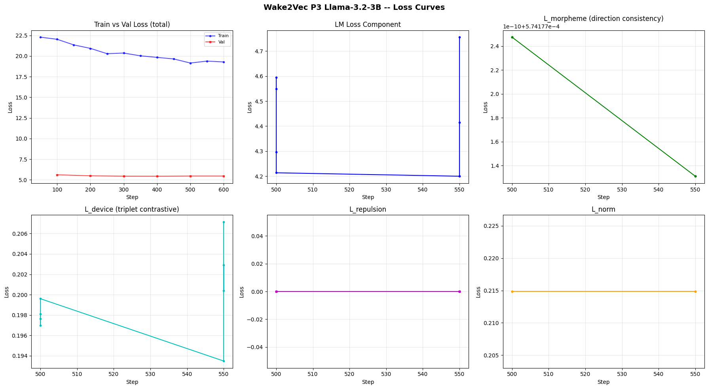

# wake2vec Llama 3.2-3B P3 (strong) Results

## Final Numbers

| Metric | Value |
|--------|-------|
| Model | meta-llama/Llama-3.2-3B (4-bit NF4) |
| Phase | P3 strong (morpheme-compositional alignment, strong λ) |
| P2 source | step 100 (best val 5.33, tied across the wall) |
| Steps | 600 (manual termination, pre-registered; MAX_STEPS was 1000) |
| Final train | 19.29 |
| Final val | **5.4653** |
| Best val | 5.44 (step 400) |
| LoRA | r=8, α=16, dropout=0.1 |
| LoRA targets | q, k, v, gate_proj, up_proj, down_proj |
| λ_morph | 50.0 |
| λ_device | 2.0 |
| λ_repulsion | 0.05 |
| λ_norm | 0.01 |
| LR | 2e-5 (halved from P2) |
| SEQ_LEN | 512 |
| Wake tokens | 44,195 |

## transient disruption, decelerating recovery, permanent offset

| Step | Train | Val | vs P2 wall (5.33) | Δval/100 |
|------|-------|-----|-------------------|----------|
| 100 | 22.03 | 5.61 | +0.28 | — |
| 200 | 20.93 | 5.49 | +0.16 | -0.12 |
| 300 | 20.37 | 5.45 | +0.12 | -0.04 |
| 400 | 19.84 | 5.44 | +0.11 | -0.01 |
| 600 | 19.29 | **5.4653** | +0.135 | +0.01 (bounce) |

P3 strong loaded the P2 best-val configuration (val 5.33) and applied strong auxiliary geometric pressure (λ_morph=50, λ_device=2). The val trajectory:

1. **Step 100 transient disruption.** Val jumped to 5.61 (+0.28 above the P2 wall). The strong λs initially pulled the LoRA configuration off the P2 minimum.
2. **Steps 200-400 decelerating recovery.** Val descended 5.61 → 5.49 → 5.45 → 5.44, with the rate dropping each interval (-0.12, -0.04, -0.01). The model rebuilt LM fit while the auxiliary losses produced nothing.
3. **Step 600 converged equilibrium with permanent offset.** Val bottomed at ~5.44 (step 400), then bounced very slightly to 5.4653. It did not return to the P2 wall. The permanent offset is **+0.135 above P2**.

**strong auxiliary pressure causes transient LM disruption followed by recovery to a stable equilibrium that sits permanently ~0.13 above the unconstrained P2 minimum.** The model cannot train the offset away across 600 steps. The auxiliary objectives leave a permanent generalisation penalty without ever producing the geometric structure they target.

## The three findings, finalised

### 1. Geometric null, confirmed at the fastest pace and at the embedding level

L_morph read 0.000574 (logged as 0.0006) across every training step from 0 to 600, with variation only at the tenth decimal place (the loss-curve plot's L_morpheme panel y-axis reads `1e-10 + 5.74177e-4`). λ=50 produced literally nothing.

Confirmed directly on the embeddings: the Wake rows drifted from their P2 positions by **cosine 0.999755** (L2 0.0288) across the entire P3 run. The strong morpheme pressure moved the embeddings by 0.0002. Even the single most-drifted Wake token only reached cosine 0.9976.

TinyLlama P3 and Llama 1B P3 each took 1000 steps to establish the null. 3B settled it by step 100 and held it.

Top-drifted Wake tokens (all barely moved): `hugacting`, **`draumcondra's`** (Drumcondra), `usherette`, `augs`, `sonly`, `whiggler`. The model concentrated its negligible movement on corpus-salient tokens.

### 2. Device clustering structurally unlearnable, confirmed third time

L_device random-walked 0.18-0.21 throughout, no convergence. The mechanism is confirmed below (device analysis section): the device categories have neither internal coherence nor mutual separation.

### 3. The lasting cost of strong λs is the generalisation gap, not LM fit

| Regime | Train | Val | Gap |
|--------|-------|-----|-----|
| P2 normal (step 600) | ~5.24 | 5.33 | 0.09 |
| P3 strong (step 200) | ~4.75 | 5.49 | 0.74 |
| P3 strong (step 400) | ~4.59 | 5.44 | 0.85 |

The train-val gap widened from 0.09 (P2) to 0.85 (P3 step 400) and kept widening as training proceeded even after val recovery decelerated. Strong λs produce structural overfitting: the model fits training blocks better and better (per-batch train LM dropping toward 4.2-4.4) while val refuses to follow. The lasting cost grows with training time.

## Embedding analysis

### Norms

| | Mean | Std | n |
|---|------|-----|---|
| Base | 1.1475 | 0.1163 | 128,256 |
| Wake | **1.7292** | **0.0031** | 44,195 |
| Welch t | t=-1790.28, p=0.00 | | |
| Cohen's d | **-7.07** | | |

Identical to P2 (Wake mean 1.7291, std 0.0032, d -7.07). P3 changed the norm structure by nothing. The spherical init (1.5x base_radius) held through both phases. Wake norm std 0.0031 is the tightest in the project.

### Isotropy

| | Score | Mean cos |
|---|-------|----------|
| All | 0.946215 | 0.0013 |
| Base | 0.982569 | 0.0001 |
| Wake | **0.998263** | -0.0000 |

Wake isotropy **0.998** is the fourth confirmation (TinyLlama P3, Llama 1B P3, Qwen P1 canonical, now Llama 3B P3 strong). Four architectures, four scales, four 0.998 values so the geometric null is structurally universal.

### Drift (P2 → P3)

| | Cosine | L2 |
|---|--------|-----|
| Base | 1.000000 ± 0.000000 | 0.000000 (gradient-masked, frozen) |
| Wake | 0.999755 ± 0.000386 | 0.0288 ± 0.0252 |

The Wake embeddings barely moved across the entire P3 run. See finding 1.

### Nearest neighbours (Wake → base)

Cosines 0.06-0.09 is statistical noise. With Wake isotropy at 0.998, every Wake token has equal-and-tiny cosine to every base token, so "nearest" returns whatever's highest in the noise floor (multilingual / code tokens). The Wake tokens shown are the French-accented multilingual layer (`paùpulation`, `générations`, `grandmère`, `fainéants`, `tricarême`, `deathfête`), confirming the polyglot Wake vocabulary spreads isotropically with no meaningful base-vocab anchoring.

### Intrinsic dimensionality (PCA)

| | 90% variance | Top-1 PC |
|---|--------------|----------|
| Base | 101+ PCs | 0.0120 |
| Wake | 101+ PCs | 0.0006 |

Wake top-1 PC explains only 0.06% of variance and is an extremely flat eigenspectrum, the signature of near-perfect isotropy (variance spread evenly across all dimensions rather than concentrated in a few). The base top-1 PC (1.2%) is 20x higher, reflecting the base region's domain clustering.

### Pairwise cosine

| | Mean |
|---|------|
| (base, base) | 0.1439 |
| (new, new) | 0.0003 |
| (base, new) | 0.0006 |
| KS test (bb vs nn) | D=0.9436, p≈0 |

Base tokens cluster by English domain structure (0.1439). Wake tokens are near-perfectly orthogonal to each other (0.0003) and to base (0.0006). The Wake region is dramatically more isotropic than base (KS D=0.94). This is the structural reason device clustering is unlearnable: there is nowhere for distinct clusters to form on a near-uniform sphere.

## Morpheme-specific analysis 

This is the finest-grained view of the geometric null in the project and explains *why* the morpheme loss could never move.

### Direction consistency by group size

For each morpheme group, the analysis computes the example−base direction vectors and measures their consistency (mean cosine to the group's mean direction). If the morpheme had a coherent compositional direction, consistency would be high.

**The linguistically real, well-sampled morphemes all show consistency ~0.10-0.24:**

| Morpheme | Pairs | Consistency |
|----------|-------|-------------|
| -s | 1034 | 0.1065 |
| -ed | 419 | 0.1275 |
| -y | 405 | 0.1472 |
| -er | 244 | 0.1485 |
| -ing | 247 | 0.1944 |
| -ly | 143 | 0.2385 |
| un- | 47 | 0.3154 |

There is a clean inverse relationship: more pairs (more statistically meaningful) have a lower consistency.

**Caveat on the "top 15 most consistent" groups:** the high-consistency morphemes (`nor-` 1.0000, `eco-` 0.9836, `syl-` 0.9748) all have only **2-3 pairs**. With two direction vectors, cosine-to-mean is mathematically near-forced to be high (the mean sits between two points, each trivially aligned). 

### embeddings encode meaning, not morphological derivation

The per-pair "least aligned" examples are the mechanism, written in tokens:

| Pair | Cosine |
|------|--------|
| evening - even | 0.0217 |
| especially - especial | 0.0064 |
| falling - fall | 0.0146 |
| Darkness - Darknes | **-0.2056** |
| Weightiness - Weightines | -0.2056 |

"Evening" is not "even + ing" in meaning, it is a time of day and sits near dusk/night in embedding space, nowhere near "even." "Especially" is not "especial + ly" in usage. **The embedding space encodes semantic usage, not morphological derivation.** When a word's meaning diverges from its morphological parse — which in Joyce's vocabulary is constant — the compositional direction collapses or inverts. (The negative cosines come from mis-stemmed non-word bases like "Darknes" that land in token-noise.)

The morpheme loss L_morph asked the embeddings to encode word-formation: the "-ing direction" should be a constant vector added to any base. The embeddings refused, because they encode what words *mean*, and meaning is not compositional in Joyce the way morphology is. **This is why L_morph never moved: it was requesting a structure that contradicts what the embedding space fundamentally represents.**

### Cross-group direction similarity

The compositional directions of different morphemes are mostly orthogonal to each other (top cross-group pair `pant- ↔ oo-` at 0.51 is again a small-sample artifact; most pairs are < 0.15, many negative). There is no shared "derivation subspace" the morphemes live in, each morpheme's (weak) direction is its own.

## two-axis confirmation

L_device's job was to cluster Wake tokens by word-formation device so each category forms a tight, distinct centroidt fails on both axes.

### Intra-group coherence (is each category internally tight?)

| Device | Words | Intra-group mean cosine |
|--------|-------|-------------------------|
| nonce | 757 | 0.0168 |
| malapropism | 690 | 0.0087 |
| portmanteau | 465 | 0.0079 |
| foreign | 150 | 0.0272 |
| pun | 61 | 0.0296 |

All near zero. Words within "portmanteau" are no more similar to each other than random Wake tokens. **There is no pre-existing cluster for the triplet loss to tighten.**

### Inter-group separation (do the categories separate?)

| | nonce | malaprop | portm | foreign | pun | faust |
|---|-------|----------|-------|---------|-----|-------|
| nonce | 1.00 | 0.73 | 0.62 | 0.69 | 0.54 | 0.02 |
| malapropism | 0.73 | 1.00 | 0.59 | 0.62 | 0.51 | 0.03 |
| portmanteau | 0.62 | 0.59 | 1.00 | 0.51 | 0.41 | 0.01 |
| foreign | 0.69 | 0.62 | 0.51 | 1.00 | 0.46 | 0.02 |
| pun | 0.54 | 0.51 | 0.41 | 0.46 | 1.00 | 0.01 |

The five main category centroids sit at 0.41-0.73 cosine to each other, they do **not** separate; their centroids pile up in the same region. 

(The centroids being 0.4-0.7 correlated while individual words are ~0 correlated reflects a small shared "Wake-token" component that survives averaging large groups while the individual differences average out.)

### Conclusion

L_device is unlearnable for a two-part structural reason, now measured on both axes: **no within-category coherence to amplify (intra ~0.01-0.03), and no between-category distinction to sharpen (inter 0.41-0.73, piled together).** The triplet contrastive loss had nothing to work with.

## Cross-phase summary (Llama 3.2-3B full pipeline)

| Phase | Best val | Wake isotropy | Wake norm std | Key finding |
|-------|----------|---------------|---------------|-------------|
| P1 | 6.68 (step 300) | — | — | U-curve, best-val early |
| P2 | 5.33 (wall) | 0.998 | 0.0032 | LoRA wall: 6 evals at 5.33, range 0.001046 |
| P3 strong | 5.44 (asymptote) | 0.998 | 0.0031 | transient disruption, +0.135 permanent offset, the null explained |

## claim update

*Strong auxiliary geometric pressure (λ_morph=50, λ_device=2) on 128K-vocab Llama at 3B parameters produces brief LM disruption followed by recovery to an equilibrium that sits permanently ~0.13 above the unconstrained P2 minimum, while moving the targeted geometric metrics by nothing (Wake embedding drift cosine 0.9998 across 600 steps). The morpheme-alignment objective fails because embeddings encode semantic usage, not morphological derivation, so where Joyce's word-formation diverges from word-meaning (evening≠even+ing), the compositional direction collapses. The device-clustering objective fails because the device categories have neither internal coherence (intra-group cosine ~0.01) nor mutual separation (inter-centroid cosine 0.5-0.7). The auxiliary losses request geometric structure that contradicts what the embedding space represents; the cost of asking is a permanent generalisation penalty.*

## Generation samples (completed)

Full samples in `outputs/p3_llama3b_generation.md`. Prompt: `riverrun, past Eve and Adam's,`

### The output: coherent English narrative with sparse, localized Wake invention

The 3B P3 generation is the opposite of Qwen P1's continuous compound-mass. Where Qwen (14B, 22% share) produced hundreds of tokens of unbroken portmanteau with no word boundaries, the 3B (26% share) produces readable, almost-grammatical prose with isolated Joyceisms sprinkled through coherent sentences:

> My old love and dear life, my true haun and best half: here, here where you lie down once again, O aquiassent and fair one!

Wake invention is sparse and embedded: `fructificationr`, `dieoguinnsisry`, `bigyttens`, `rainkisselds`, `caratimaney`, `showeryweatherory`, `aquiassent`, `humselfness`, `glatschfs`, `nickstges`. Single invented words inside fluent English, not a compound-mass.

### This is the refined paradox's "medium band," demonstrated

| Model | Share | Scale | Generation character |
|-------|-------|-------|----------------------|
| TinyLlama 1.1B | 58% | 1.1B | denser Wake, periodic portmanteau bursts |
| **Llama 3.2-3B** | **26%** | **3B** | **coherent English narrative and sparse invention** |
| Qwen 2.5-14B | 22% | 14B | continuous compound-mass, no word breaks |

The 3B routes *through* its bridge tokens (the `wher`/`leas`/`befor` boundary tokens identified in the drift analysis), staying in fluent English between Wake bursts. Qwen stayed *inside* the isotropic Wake region and never returned to English. Two distinct generative regimes, exactly as the geometric findings predict: the 3B's Wake region is only 26% of vocab so the model leans on its English base; Qwen's 14B scale let it inhabit the Wake region fully.

### Notable features

1. **The model transforms the prompt into Wake at high temp.** At temp 1.2, "past Eve and Adam's" came back as **"past Eavesdamp"** is a genuine portmanteau collapse of the prompt phrase. Real Wake-style processing of the input, not just sprinkled neologism. Temp 1.2 is where the 3B reaches its highest Wake density (`soe-tern silve`, `thosenesses`, `bhing man: Staffusen`).

2. **Base-prior leakage at low temp.** At temp 0.5 the model pulled in `The Book of the New Sun` (Gene Wolfe) and English place names (Vauxhall Bridge, Kent). The 26%-share signature: conservative sampling lets the dominant English base reassert itself, producing generic literary prose rather than Wake. Higher temperature is required to push the model into the Wake region — the inverse temperature-Wake-quality relationship.

3. **Wake-character anchoring.** `Shaun Mungo` (Shaun, of Shem-and-Shaun) appears as a narrative anchor even in otherwise-generic prose, confirming the Wake vocabulary is present and reachable.

### The degradation prediction: not visibly confirmed

The prediction from the +0.135 val penalty was that P3 strong's generation would be visibly rougher than P2 would produce. **It is not.** The generation is coherent, even nice-ish in places. The +0.135 penalty is largely *numeric*: it shows in held-out perplexity but not in obviously broken generation.

result: **strong auxiliary λs cost generalisation (the train-val gap, 0.09 → 0.85) without visibly degrading generation quality.** The cost is real in the loss numbers and subtle-to-invisible in the output. A reader of the generation samples alone could not tell P3 strong from P2; only the perplexity reveals the penalty. The auxiliary geometric machinery left a measurable numeric trace and no qualitative one.
