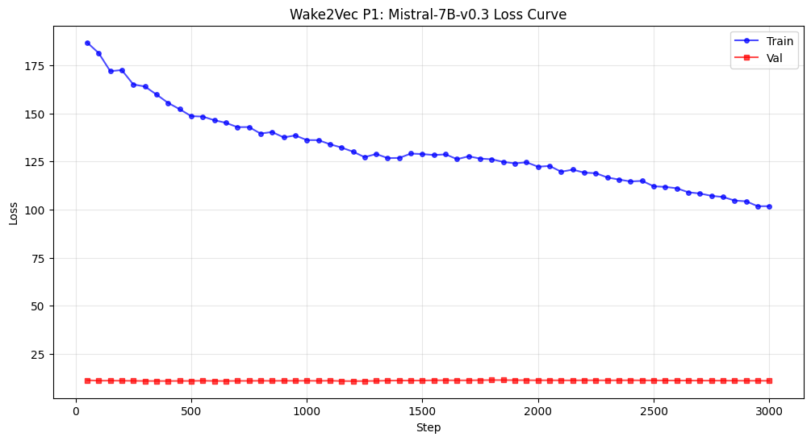
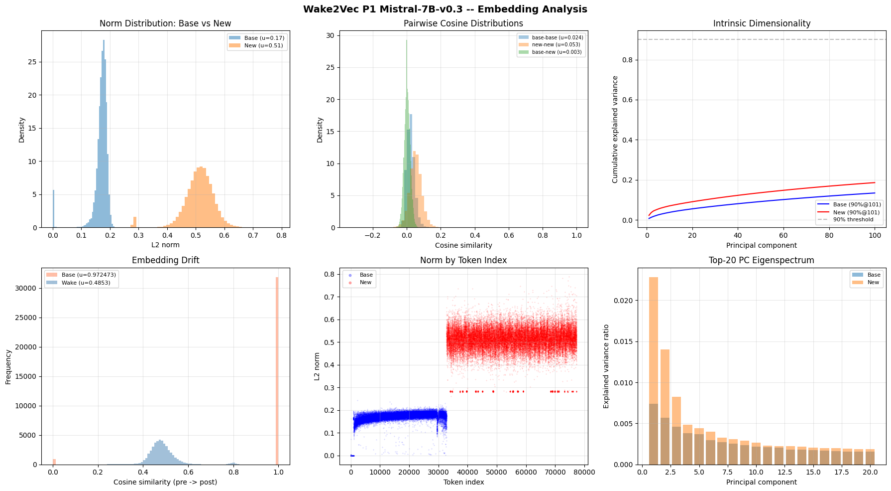

# wake2vec Mistral 7B v0.3 P1 Results

## Final Numbers

| Metric | Value |
|--------|-------|
| Model | mistralai/Mistral-7B-v0.3 (4-bit NF4) |
| Phase | P1 (embedding-only fine-tune, gradient masking) |
| Architecture | sliding-window attention |
| Base vocab | 32,768 |
| Wake tokens added | 44,553 |
| Total vocab | 77,321 |
| Wake-vocab-share | ~58% (TinyLlama cohort) |
| Steps | 3,000 (33 Colab sessions) |
| Final train | 101.78 |
| Final val | **11.0936** |
| Best val | 11.0936 (step 3000, still descending at the buzzer) |
| Optimizer | AdamW |
| Embedding init | Spherical, 1.5x base radius |
| SEQ_LEN | 256 |
| Effective batch | 16 |

## loss curve: a long P1 that learned, ending still in motion

Mistral's P1 has one of the strongest embedding-learning result in the lineup. Across 3000 full steps the validation loss descended from the low-20s to 11.0936, and it was still descending at the endpoint (steps 2900, 2950, 3000 read 11.124, 11.124, 11.0936). The second 11.0 break, first crossed in March at val 10.92 and lost in the long survey-phase plateau, was missed by a fraction.

### The trajectory in three acts

1. **First break and recovery (through ~step 2150).** Broke 11.0 at step 1150 (val 10.92), then drifted back up into a band around 11.3.
2. **The survey-phase plateau (steps ~2150 to 2500).** Twelve consecutive evals wobbling inside an 11.28 to 11.35 band while train descended steadily underneath. The val held flat for roughly 350 steps.
3. **The sustained descent (step 2500 to canonical).** The val broke below the survey band at step 2500 (11.27) and descended monotonically across eleven evals to 11.0936, train falling from 112 to 101.78 underneath it. The descent decelerated mid-way then re-steepened, never plateauing; it was still in motion when the schedule ended.

## Embedding analysis: the machine was learning 

Mistral is the 58% Wake-vocab-share datapoint at 7B scale (matching TinyLlama's share at a larger body), and its embedding analysis shows the deepest Wake-specific reorganization of any model measured.

### 1. Norms

| | Mean | Std | n |
|---|------|-----|---|
| Base | 0.1678 | 0.0329 | 32,768 |
| Wake | **0.5108** | **0.0550** | 44,553 |
| Welch t | t=-1079.31, p=0.00 | | |
| Cohen's d | **-7.57** | | |

Spherical 1.5x init produces a distinct elevated Wake shell, as in the other spherical-init models. Cohen's d of -7.57 is the largest norm separation in the lineup (TinyLlama and 3B were near -7). The Wake region sits well clear of the base region in norm space; the "Norm by Token Index" panel shows two cleanly separated bands (base around 0.17, Wake around 0.51). This is the spherical-init signature and the opposite of the 8B's compositional-init integrated norms (Cohen's d -1.25).

### 2. Isotropy and the first model below the 0.998 attractor

| | Score | Mean cos |
|---|-------|----------|
| Base | 0.960480 | 0.0004 |
| Wake | **0.994950** | -0.0000 |

The geometric null holds (the Wake region is near-isotropic), but Mistral is the **first model in the lineup to land below the 0.998 isotropy attractor**, at 0.995. The previous five confirmations (TinyLlama P3, Llama 3.2-1B P3, Llama 3.2-3B P3, Qwen P1, Llama 3.1-8B P1) all read 0.998. Mistral reads 0.995. The difference is small but it is corroborated by two other measurements (PCA and pairwise cosine, below), and it has a coherent explanation: Mistral did the most embedding reorganization in the lineup, and deep reorganization left the Wake region with slightly more internal structure than the models that moved less.

### 3. Drift: the most reorganization in the lineup

| | Cosine | L2 |
|---|--------|-----|
| Base | (frozen; see note) | 0.000000 |
| Wake | **0.485298 +/- 0.0683** | 0.4473 +/- 0.0615 |

The Wake tokens drifted to cosine **0.485** from their spherical init, roughly 61 degrees of angular movement. This is by far the largest Wake drift measured (Llama 3.1-8B P1 was 0.88, Llama 3.2-3B P3 was 0.9998). Mistral genuinely reorganized its Wake embeddings during P1; it did not coast. The drift is the dynamic signature of a model that descended a long way (val low-20s to 11.09) over a full 3000-step schedule.

footnote: the analysis cell flagged "significant base drift despite gradient masking" because the base cosine read 0.972 with std 0.164. This is a numerical artifact, not real drift. The base L2 distance is 0.000000: the base embeddings are bit-frozen, gradient masking worked perfectly. The cosine instability comes from a handful of near-zero-norm base tokens (rare or unused vocabulary) where cosine similarity is undefined-adjacent because the denominator approaches zero. The L2 distance is the reliable measure here, and it confirms the base did not move.

**Top-drifted Wake tokens (full neologisms, not bridge fragments):** quims, gosem, glows, scherts, fraywhaling, almonders, pederect, geesyhus, hatpinny, vicking, moyle, forgetness, magorios, frisk, velligoolapnow, bootifull, bartrossers, shyblumes, nargleygargley, hellfeuersteyn.

This is a key contrast with the 8B since the 8B's most-drifted tokens were truncated-English bridge tokens (himsel, befor, wher, throug): the compositional init had placed them wrongly at the English boundary, and training moved them to correct the error. Mistral's most-drifted tokens are **full Wake neologisms** (velligoolapnow, nargleygargley, hellfeuersteyn, fraywhaling). Training moved the rich content words most because it was learning what they mean, not fixing where an init put them. **The 8B corrected its init; Mistral learned Wake content.** This is deeper Wake-specific learning, and it is what the 58% cohort is expected to do before the suspension test at P2.

### 4. Nearest neighbours (noise, plus code and instruct-format leak)

Wake-to-base cosines are 0.06 to 0.12, statistical noise consistent with the near-isotropic Wake region. The Wake tokens shown are the French-accented multilingual layer (paùpulation, générations, grandmère, fainéants, tricarême, deathfête) shared with the other models.

Two notable features:
- **Code-register leak**, as in the Llama 3.1-8B: neighbours include `/**\r`, `*/\r`, `]);\r`, `});\r`. Mistral v0.3 is code-trained, so its base manifold is code-dense and the Wake neighbourhoods reach code tokens. The code-register breakthrough extends from the 8B to Mistral.
- **Instruct-format leak**, unique to Mistral so far: neighbours include `<s>`, `[/INST]`, `[AVAILABLE_TOOLS]`, Mistral's own instruction-format special tokens. The babel reaches the model's own scaffolding.

### 5. Intrinsic dimensionality (PCA)

| | 90% variance | Top-1 PC |
|---|--------------|----------|
| Base | >100 PCs | 0.0074 |
| Wake | >100 PCs | **0.0228** |

Both regions are high-dimensional, but the Wake top-1 PC (0.0228) is higher than base (0.0074) and far higher than the 3B's Wake top-1 (0.0006). The Wake region carries more variance in its leading direction than the base region, the inverse of the spherical-init models where Wake was more isotropic than base. This corroborates the sub-0.998 isotropy: Mistral's Wake region has more internal structure than the perfectly-isotropic models'.

### 6. Pairwise cosine

| | Mean | Std |
|---|------|-----|
| (base, base) | 0.0237 | 0.0232 |
| (new, new) | **0.0528** | 0.0369 |
| (base, new) | 0.0030 | 0.0178 |
| KS test (bb vs nn) | D=0.4371, p≈0 | |

The new-new mean (0.0528) is higher than base-base (0.0237): Wake tokens are *more* similar to each other than base tokens are to each other. In every other model new-new was near zero and below base-base. This is the third corroboration that Mistral's Wake region is the most internally structured in the lineup. The Wake tokens have begun to cluster, slightly.

## The synthesis: less isotropy equals more learning

Three independent measurements (isotropy 0.995, Wake top-1 PC 0.0228, new-new cosine 0.0528) agree that Mistral's Wake region is the most internally structured in the lineup, the first to fall below the 0.998 isotropy attractor. The drift measurement (0.485, the largest in the lineup) shows that Mistral reorganized its embeddings the most, and deep reorganization deposits structure.

This inverts the naive expectation. The model that moved its embeddings *least* (Llama 3.1-8B, drift 0.88) stayed *nearest* the isotropic init (0.998). The model that moved *most* (Mistral, drift 0.485) developed the *most* structure (0.995). 

### A P3 hypothesis for Mistral

Every model that reached P3 produced a geometric null: the auxiliary losses (morpheme alignment, device clustering) moved nothing, because the Wake region was perfectly isotropic (0.998) and there was no pre-existing structure for the losses to amplify. Mistral's Wake region is the first that is *not* perfectly isotropic. This raises a testable hypothesis: Mistral may be the one model where P3's auxiliary losses can move something, because its Wake region carries pre-existing structure (new-new cosine 0.0528, top-1 PC 0.0228) that the morpheme and device losses could latch onto and amplify. If P3 moves on Mistral where it was null on every other model, the explanation is in this P1 analysis: the structure was there to work with. This is the sharpest forward-looking prediction the P1 analysis produces and it should be tested directly when Mistral reaches P3.

## Generation battery (P1 preview; full samples pending)

A single temp-0.9 P1 sample was captured before a runtime cut; the remaining sweep is pending and will be added tomorrow.

P1 generation is embedding-only (frozen transformer, no LoRA routing), and is rough across the entire lineup by construction: the model has reorganized its embeddings but has not been adapted to route them into syntax. Mistral's P1 sample is correspondingly rough, surfacing bridge tokens (firs, himsel, wher, befor, giv, cru) and neologism-masses (nigcrowdblastpraeolithostroton) before dissolving into near-pure punctuation toward the end. The dissolution into marks is partly a Wake-adjacent move (the Wake has passages that approach pure sound and mark) and partly the expected P1 roughness of a frozen transformer that cannot yet route the reorganized embeddings.

The real voice test for Mistral is P2. The P1 preview establishes that the micro-units are richly learned (the deepest drift in the lineup); whether the arrow makes them rise coherently, holding the suspension that TinyLlama held rather than over-deforming as the 8B did, is the question P2 answers. Given that Mistral matches TinyLlama's 58% share and did the deepest P1 embedding learning, the prior on a strong P2 generation result is favourable. Full P1 sample sweep and the P2 comparison to be added.

## Cross-model placement

| Model | Params | Vocab | Share | Init | Wake drift | Wake isotropy | P1 best val |
|-------|--------|-------|-------|------|-----------|---------------|-------------|
| TinyLlama 1.1B | 1.1B | 32K | 58% | spherical 1.5x | (P3 measured) | 0.998 | (low, U-curved) |
| Llama 3.2-1B | 1B | 128K | 26% | spherical 1.5x | | 0.998 | 5.36 |
| Llama 3.2-3B | 3B | 128K | 26% | spherical 1.5x | 0.9998 (P2 to P3) | 0.998 | 6.68 |
| Llama 3.1-8B | 8B | 128K | 26% | compositional 1.0x | 0.88 | 0.998 | 11.36 |
| **Mistral 7B v0.3** | **7B** | **32K** | **58%** | **spherical 1.5x** | **0.485 (most)** | **0.995 (least isotropic)** | **11.09** |

Mistral is the deepest-learning P1 in the lineup and the second complete 58%-cohort P1 (with TinyLlama). It pairs with TinyLlama for the suspension test at P2: same share, larger body, the cleanest test of whether 58% Wake share holds the fine line at 7B scale the way it did at 1.1B.

## Summary

Mistral 7B v0.3 P1 is complete at val 11.0936, still descending at the canonical endpoint. Its contribution is the deepest Wake-specific embedding learning in the lineup: the largest drift (0.485), the most internally structured Wake region (the first below the 0.998 isotropy attractor, corroborated by PCA and pairwise cosine), and a drift profile concentrated on full neologisms rather than bridge tokens, indicating genuine Wake-content learning rather than init correction. The structure is the trace of the work: less isotropy means more learning. The forward-looking prediction is that Mistral may be the one model where P3's auxiliary losses can move something, because it is the one model whose Wake region is not perfectly isotropic. The P2 suspension test, paired against TinyLlama at matched 58% share, is the next phase.
