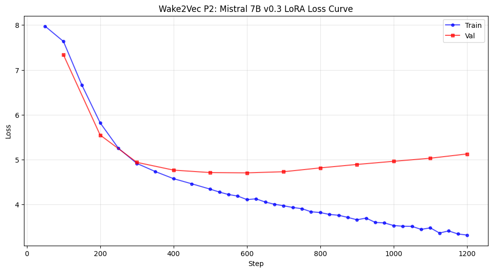

# wake2vec Mistral 7B v0.3 P2 Results

## Final Numbers

| Metric | Value |
|--------|-------|
| Model | mistralai/Mistral-7B-v0.3 (4-bit NF4, sliding-window attention) |
| Phase | P2 (LoRA behavioural adaptation) |
| P1 source | step 1200 (best val 10.9181) |
| Steps | 1200 (cut after the ascending limb was drawn) |
| **Best val** | **4.705 (step 600, global minimum, the turn point)** |
| Best-val delta from P1 | **−6.21** |
| Final val (step 1200) | 5.126063 |
| Final train (step 1200) | 3.317783 |
| Final train–val gap | 1.808 |
| LoRA rank | 8, alpha 16, dropout 0.1 |
| LoRA targets | q_proj, k_proj, v_proj, gate_proj, up_proj, down_proj |
| Embeddings | Frozen (from P1 step 1200) |
| SEQ_LEN | 512 |
| Wake injection | 44,553 tokens (~58% share) |

Mistral's P2 is a clean overfit arc: a full descend-turn-ascend curve with the minimum banked at the vertex and both limbs drawn at readable rates.

| Step | Train | Val | Note |
|------|-------|-----|------|
| 200 | — | 5.55 | steepest early descent in the set |
| 400 | — | 4.77 | into the 4s while every other P2 was in the 5s and 6s |
| 600 | 4.108 | **4.705** | **global minimum, the turn point, the P2 source.** gap 0.597 |
| 700 | — | 4.730 | first overfit-shaped eval (val up, train down) |
| 800 | 3.820 | 4.815 | turn confirmed, +0.085 |
| 900 | 3.658 | 4.892 | third overfit eval, +0.077, gap 1.234 |
| 1000 | 3.530 | 4.962 | +0.070, gap 1.432 |
| 1100 | 3.479 | 5.031 | +0.069, crosses back above 5.0, gap 1.551 |
| 1200 | 3.317783 | 5.126063 | the cut. **+0.095, off the cadence**, gap 1.808 |

Three properties make this the reference curve for the lineup:

1. Val reached the 4s by step 400 while the 8B, 3B and Qwen were still in the 5s and 6s at comparable points, and the minimum (4.705) is 6.21 below the P1 best.
2. Validation rose at consecutive evaluations while training loss continued to fall monotonically (4.108 → 3.820 → 3.658 → 3.530 → 3.479), so the divergence is a genuine overfit shape rather than a single-evaluation fluctuation.
3. After a short accelerating departure from the floor (+0.025, +0.085), the rises settle to a near-constant +0.077, +0.070, +0.069 per hundred steps, three consecutive points within 0.008 of each other. The sixth and final point departs from that cadence: +0.095, against ~+0.069 predicted, the largest limb rise since the departure from the floor.

The final interval is an acceleration on both axes, not a val-side fluctuation. Train fell 0.161 across it, having decelerated steadily beforehand (−0.288, −0.162, −0.128, −0.051), and the gap opened 0.257 in one hundred steps against roughly 0.11 per 
point earlier (0.597 to 1.234 to 1.432 to 1.551 to 1.808). The model was memorising harder and generalising worse, faster, at the moment the run was cut.

P2 freezes the embedding matrix and trains only LoRA adapters, so Wake and base drift are zero by construction, as the 3B's P2 confirmed empirically (cosine 1.000000, std 0.000000, for both populations). 

| Property | Mistral P1 | Rest of lineup |
|---|---|---|
| Wake embedding drift | **cosine 0.485** | 0.88 (8B), 0.9685 (Phi) |
| Wake-region isotropy | **0.995** | 0.998 everywhere else |
| Most-displaced tokens | full neologisms | truncated boundary tokens |

The largest reorganisation in the set, and the only Wake region measured below the 0.998 isotropy attractor. That single fact is what makes Mistral's P3 the project's one live shot at breaking the geometric null.

## Cross-model P2 comparison

| Model | Vocab | Best val | Step | Morphology |
|---|---|---|---|---|
| **Mistral 7B** | 32K | **4.705** | 600 | gentle-monotonic turn, limb linear then steepening |
| Llama 3.1-8B | 128K | 5.1486 | 900 | soft-floor-then-turn, shallow irregular limb |
| Llama 3.2-3B | 128K | 5.33 | 100 | capacity wall, six identical evals |
| Qwen 2.5-14B | 152K | 5.9209 | 1600 | noisy-train crawler, no confirmed turn |
| Phi-3.5 | 32K | in progress (8.684 @ 300) | — | free descent, no turn yet |

Absolute validation values are only directly comparable within a shared tokenizer: the 8B and 3B share one exactly, and Mistral and Phi share a 32K vocabulary at matched 58% Wake share. Across differing vocabularies the validation token mixture 
differs and the comparison is of trajectory shape (fixed ceiling versus continued descent versus confirmed turn).

Within that rule, two results stand:

- Mistral is the deepest P2 in the set, and its only legitimate comparator, Phi, is the controlled partner in the pretraining-data 2x2. That comparison is not yet decidable; Phi is still descending.
- Three turn morphologies now exist under one protocol: Mistral's gentle-monotonic turn with a limb that ran linear for three points then steepened, the 8B's soft-floor-then-turn with a shallow irregular limb, and Qwen's noisy-train crawl that
has produced three turn signals and refuted all three. The 3B contributes a fourth shape, the capacity wall, reached within 100 steps and never left. That turn-detectability tracks train-curve smoothness is itself a methodological finding:
the same protocol and the same reading rules yield a legible curve at 7B and 8B under AdamW and an illegible one at 14B under Adafactor.

## The generation result

Full battery in `p2_mistral7b_generation.md`. The summary:

P2 Mistral holds suspension. P1 was the dissolution pole, the widest babel in the lineup, fragmented at every temperature and unable to revert to coherence even at temp 0.5. P2 returns the syntax without costing the invention: 
dense coinage (`witchbefooled`, `transhibernian`, `insodaintily`, `voiceyversy`, `diesparation`) carried inside sentences that parse, with em-dash dialogue turns in Joyce's own convention, and Wake material surfacing at the level of character 
and motif rather than isolated lexicon (`dolph`, `cumb and cwympty` with the Welsh *cwymp*, `liviam`, `prefall`, `pairc`, river names, a small thunderword, `farternoiser`, `cathalogue`). The temp=1.2 sample emits `[4]` and `[1064\]` as footnote markers, 
reaching for the II.2 marginal apparatus unprompted.

Two structural changes from P1:

1. Bridge tokens receded. The truncated-English fragments that saturated P1 (`himsel`, `befor`, `wher`, `thos`, `stoo`) are largely replaced by complete invented words. The micro-units were acquired in P1 and emitted raw; P2 routed them and they emerge composed.
2. The contemporary-register leak closed. P1 leaked emoji at every temperature plus code tokens and a wide non-Latin script range; the P2 sweep contains none. The register collision narrowed onto period-appropriate materials (Irish, Latin, Welsh, legal, liturgical, literary allusion). **The batteries are decode-matched**: `wake2vec_mistral7b_p1.py` ran the same `top_p=0.92, top_k=50, repetition_penalty=1.15` over the same temperature sweep (lines 940-943, 971), so truncation cannot account for the disappearance, and the emoji survived that truncation at every P1 temperature. The one residual difference is the embedding checkpoint (P1 generated from step 3000, P2 froze step 1200), and its direction is conservative: the less-reorganised embeddings sit closer to the base distribution the leak draws on, so they should leak more, not less. A P1-style generation from step 1200 closes it exactly.

Temperature behaviour inverts against P1: 0.5 and 0.7 are the strongest samples here, and quality degrades upward, so the usable band for regeneration from this checkpoint is low.

## Implications for P3

Mistral's P3 is the project's single live shot at breaking the geometric null. The null has held across four configurations (TinyLlama P3 and P3b, Llama 3.2-1B P3, Llama 3.2-3B P3): L_morph immovable at the fourth decimal, L_device a random walk, 
Wake isotropy pinned at 0.998, and under λ_morph=50 the 3B's Wake rows drifting only cosine 0.9998 across 600 steps. The standing structural diagnosis is that near-perfect isotropy leaves no pre-existing structure for the auxiliary losses to amplify: 
the device triplet loss asks embeddings to cluster by word-formation process while embeddings encode meaning and usage, and on a near-uniform sphere there is no preferential direction for clusters to form.

Mistral is the one model whose P1 violates that precondition. Its Wake region came out at 0.995 isotropy with drift cosine 0.485, the largest reorganisation in the set, and its most-displaced tokens are full neologisms rather than boundary fragments. 
If any configuration has deposited internal geometric structure for λ_morph=50 to grab, it is this one.

## Summary

Mistral 7B v0.3 P2 is the reference curve of the lineup and, on the interpretive criterion, its strongest generation result to date. Best val 4.705 at step 600, −6.21 from the P1 minimum and the deepest P2 in the set, reached by the steepest descent 
in the set, turned on the strictest criterion available, and followed by an ascending limb that ran linear for three points and then steepened at the cut (+0.095, gap 1.808). The generation from that checkpoint is the suspension case: the invention 
of P1's maximal babel, now carried inside syntax that parses, with the register filtered onto Joyce's own materials and the Wake's typographic apparatus reproduced unprompted.

the arrow works, and it works best on the richest micro-units. Mistral did the deepest embedding reorganisation in P1 and got the deepest routing and the best generation in P2. Where the μ is rich, the UP rises.
