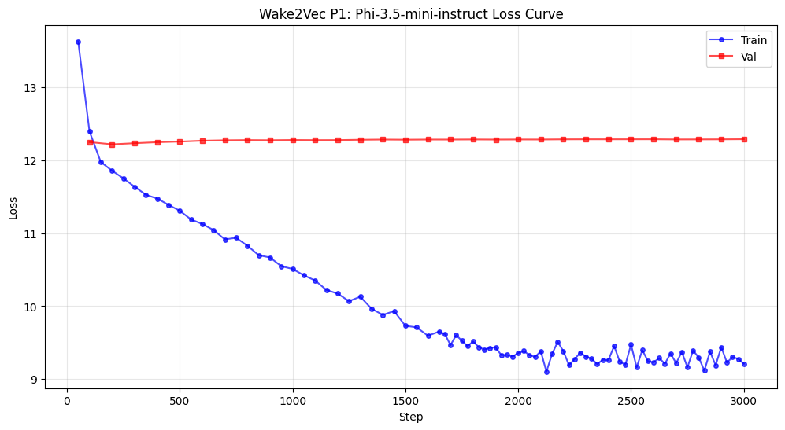
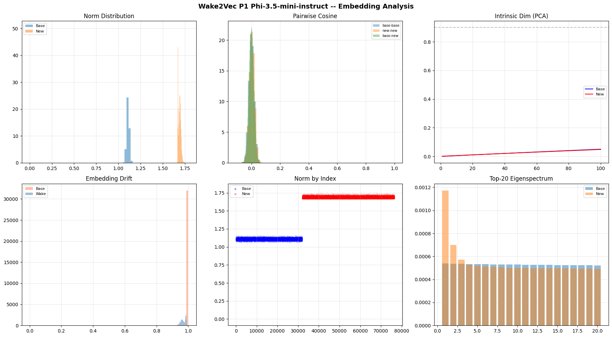

# wake2vec Phi-3.5-mini-instruct P1 Results

## Final Numbers

| Metric | Value |
|--------|-------|
| Model | microsoft/Phi-3.5-mini-instruct (4-bit NF4) |
| Phase | P1 (embedding-only fine-tune, gradient masking) |
| Architecture | Phi-3 (fused qkv_proj / gate_up_proj), instruct-tuned |
| Base vocab | 32,011 (embedding matrix padded to 32,064) |
| Wake tokens added | 44,500 |
| Total vocab | 76,511 |
| Wake-vocab-share | ~58% (TinyLlama / Mistral cohort) |
| Steps | 3,000 |
| Final train | 9.2111 |
| Final val | **12.2884** |
| Best val | **12.2177** (early shallow minimum; see the P2-source note below) |
| Optimizer | AdamW |
| LR | 2e-4 |
| Embedding init | Spherical, 1.5x base radius |
| SEQ_LEN | 512 |
| Effective batch | 16 |

## The wall: a P1 that memorised but never generalised

Phi is the textbook-resists datapoint, and it is the clearest single result in the lineup because it produced a near-perfect train/val dissociation. Across 3000 steps the training loss fell from ~12.4 to 9.2111, still setting a new low at the very last step 
(never once saturating). Held-out validation did the opposite: it dropped to a shallow early minimum (12.2177), rose slightly, and then sat on a flat wall at ~12.28 for the remaining ~2900 steps, a point worse than the uniform-token baseline 
(~11.25 for this configuration). The run ended at its maximal divergence: train at a floor it never reached, val at its highest (12.2884), a train/val gap of 3.077.

### The trajectory in one act

There is no second act. Unlike Mistral (a long descent) or the 8B (a descent-then-turn), Phi's validation curve does one thing and then stops moving:

1. The shallow dip (through ~step 300): Val dropped from ~12.24 to its global minimum, 12.2177, in the first few evals, while the base-frozen embeddings took their first steps.
2. The wall (step ~300 to 3000): Val rose a hair off the minimum and then held, pinned to the third decimal, for the rest of the run. Late evals read 12.285, 12.286, 12.287, 12.288, an upward creep of thousandths across two thousand steps. Meanwhile train descended monotonically-with-noise underneath (into the low 9s, wobbling ±0.2 but net down, no saturation).

The finding is that the training text was memorised; the held-out text was never generalised and it is the loss-curve half of the Phi-vs-Mistral controlled comparison.

### A note on the best-val step (P2 source)

The devlog tables recorded the P1 minimum as 12.233 at step 300; the analysis reports the true global minimum as 12.2177 (`min` over the full log history), which the loss curve places slightly earlier than step 300 (near steps 100 to 150, on the descending 
shoulder). The two differ by only 0.015, and the entire val curve lives inside a ~0.07 band, so within the noise the "best" checkpoint is nearly arbitrary. But by the best-val-source convention (lowest val), the true argmin is the ~12.2177 checkpoint, 
not step 300. 

## Embedding analysis: the data wall's geometry

The prediction going into the analysis, from the loss-curve finding, was: the Wake region should still reach ~0.998 isotropy (the training-dynamics attractor seen in every model) but with little reorganisation drift, since the val curve says no generalising 
Wake subspace formed. 

Phi is the geometric complement of Mistral: same 58% share, same spherical init, same architecture family, only pretraining data differs, and it reorganised its Wake embeddings the least of any model measured where Mistral reorganised the most.

### 1. Norms

| | Mean | Std | n |
|---|------|-----|---|
| Base | 1.1083 | 0.0154 | 32,011 |
| Wake | 1.6879 | 0.0148 | 44,500 |
| Welch t | t=-5215.41, p=0.00 | | |
| Cohen's d | -38.35 | | |

Spherical 1.5x init produces the expected elevated Wake shell, and the "Norm by Index" panel shows two cleanly separated tight bands (base ~1.11, Wake ~1.69). The Cohen's d of -38.35 is by far the largest norm separation in the lineup (Mistral, 
the previous largest, was -7.57), but the reason is the opposite of learning: both distributions are extraordinarily tight (std 0.0148 and 0.0154). The Wake tokens all sit at nearly the same radius because none of them moved off the init shell. 
The tight Wake norm-std (0.0148) is itself a reorganisation proxy: Mistral's Wake std spread to 0.055 as it reorganised; Phi's stayed at 0.0148, the width of the init. The huge separation is a signature of a region frozen near where it started, 
not of one that learned.

### 2. Isotropy: at the attractor

| | Score | Mean cos |
|---|-------|----------|
| All | 0.996975 | 0.0001 |
| Base | 0.998314 | -0.0000 |
| Wake | **0.998214** | -0.0000 |

The Wake region reads 0.998, back at the isotropy attractor that TinyLlama P3, Llama 1B/3B P3, Qwen P1, and Llama 8B P1 all landed on. This is the predicted half: Phi did not fall below the attractor the way Mistral (0.995) did. Following the Mistral 
synthesis ("isotropy measures how little the region has been shaped away from its uniform init"), Phi's 0.998 says the region was shaped away from init almost not at all. Mistral fell to 0.995 because it reorganised; Phi held 0.998 because it did not.

### 3. Drift: the least reorganisation in the lineup

| | Cosine | L2 |
|---|--------|-----|
| Base | 0.999969 (frozen, gradient masking clean) | ~0 |
| Wake | **0.9685 +/- 0.0159** | 0.4076 +/- 0.1102 |

The Wake tokens drifted to cosine 0.9685 from their spherical init, roughly 14 degrees of angular movement, the smallest Wake drift measured at P1 (Mistral 0.485 / ~61 degrees, Llama 8B 0.88 / ~28 degrees). Phi's Wake embeddings barely rotated. 
Even the L2 (0.41) is small relative to the Wake norm (1.69), a ~24% radial nudge with almost no angular change. Base cosine 0.999969 confirms gradient masking held (the base is bit-frozen).

Top-drifted Wake tokens (scribings, erthe, ratty, cubarola, flitch, swaddled, clothiering, ritzies, mercias, ambries, notever, buglooking, puzzly, pinkman, galways, wholume, rancing, parsnip, dumpling, sheemen's): note the interpretive weakness here. 
Even the most-moved Phi tokens only reached cos ~0.885 (~28 degrees), less angular movement than Mistral's average Wake token. In a population that barely moved, the top-drifted list is a mix of neologisms (cubarola, wholume, buglooking, notever) and 
near-real words (swaddled, dumpling, parsnip, ratty) with no clear pattern, because the movement is too small to be meaningfully directional. Contrast Mistral, whose top-drifted tokens were unmistakably full neologisms (velligoolapnow, nargleygargley), 
the trace of a model learning content. Phi's list is the trace of a model that did not.

### 4. Nearest neighbours (pure noise, no semantic integration)

Wake-to-base cosines are 0.06 to 0.086, at the floor of statistical noise for a near-isotropic region, and the neighbours are random junk: code tokens (HTTP, POST, docker, Toggle, Entity, predict), foreign-script fragments (공, 조, ひ, ض, сли, кла), 
and byte-fallbacks (`<0x87>`, `<0x99>`, `▇`, `┼`). There is no English-morphological coherence anywhere. The French-accented multilingual layer shown (paùpulation, générations, grandmère, fainéants, tricarême, deathfête, brofèsor) is the same set the other 
models surface, but where a reorganised model deposits some signal in these neighbourhoods, Phi shows none. The code/CJK leak present in the 8B and Mistral appears here too, but in Phi it is indistinguishable from noise, because there is no learned 
structure for it to sit against.

### 5. Intrinsic dimensionality (PCA)

| | 90% variance | 95% variance |
|---|--------------|--------------|
| Base | 101 PCs | 101 |
| New | 101 PCs | 101 |

Base and new are identical and maximally high-dimensional (101 PCs to reach 90%). The Top-20 eigenspectrum shows the Wake region with two or three marginally elevated leading eigenvalues (top-1 ~0.00117 vs base ~0.00053) before the spectra converge and 
run flat together. This is a whisper of internal structure, far less than Mistral's (whose Wake top-1 PC was 0.0228), and consistent with the near-perfect isotropy: essentially no low-dimensional Wake subspace formed.

### 6. Pairwise cosine

| | Mean |
|---|------|
| (base, base) | 0.0001 |
| (new, new) | 0.0041 |
| (base, new) | -0.0001 |

The new-new mean (0.0041) is marginally above base-base (0.0001), so the Wake tokens are a hair more similar to each other than base tokens are, but both are essentially zero. Compare Mistral, whose new-new reached 0.0528 (the most internally structured Wake 
region in the lineup). Phi's 0.0041 is more than ten times smaller: the Wake region has almost no internal coherence. The (base, new) -0.0001 confirms Wake and base are orthogonal (the separated shell).

## The synthesis: the data wall, and the 2x2 confirmed in geometry

Three independent measurements agree that Phi's Wake region is the least internally structured, least reorganised region in the lineup: isotropy at the 0.998 attractor (not below it), Wake drift 0.9685 (the smallest P1 drift, ~14 degrees), 
new-new cosine 0.0041 (an order of magnitude below Mistral's). The tight norm shell (std 0.0148) is the fourth agreement. The Wake embeddings ended P1 almost exactly where spherical init put them.

This is the geometric half of the Phi-vs-Mistral controlled comparison, and it confirms the loss-curve half exactly. The two models share everything the design can hold fixed, 58% Wake-vocab-share, spherical 1.5x init, architecture family, corpus, 
hyperparameters, and differ only in pretraining data (Mistral web-trained, Phi filtered "textbook"). Their P1 outcomes are opposite poles on the reorganisation axis:

| | Mistral (internet) | Phi (textbook) |
|---|--------------------|----------------|
| Val curve | descended to 11.09, still falling | shallow dip, then a flat wall at ~12.28 |
| Wake drift | 0.485 (most, ~61 degrees) | 0.9685 (least, ~14 degrees) |
| Wake isotropy | 0.995 (below the attractor) | 0.998 (at the attractor) |
| new-new cosine | 0.0528 (most structure) | 0.0041 (almost none) |
| Reading | learned Wake content | memorised train, generalised nothing |

The reorganisation depth is data-driven: the only variable between these two models is what their base transformer was pretrained on, and it produces the deepest and the shallowest Wake reorganisations in the lineup. The textbook prior does not block local 
memorisation (train descends to the low 9s) but it does block the formation of a generalising Wake subspace (val walls, embeddings barely move). This inverts the Mistral synthesis and confirms it: less isotropy equals more learning; Phi is the most isotropic 
and learned the least.

### P3 note

The Mistral analysis predicted Mistral may be the one model where P3's auxiliary losses can move something, because its Wake region carries pre-existing structure to amplify. Phi is the opposite extreme: a perfectly-isotropic Wake region (0.998) with 
near-zero internal structure (new-new 0.0041). If Phi ever reaches P3, it should produce the most emphatic geometric null in the lineup, there is nothing at all for the morpheme or device losses to latch onto. Phi and Mistral bracket the P3 hypothesis 
from both ends.

## Cross-model placement

| Model | Params | Vocab | Share | Init | Wake drift | Wake isotropy | P1 best val |
|-------|--------|-------|-------|------|-----------|---------------|-------------|
| TinyLlama 1.1B | 1.1B | 32K | 58% | spherical 1.5x | (P3 measured) | 0.998 | (low, U-curved) |
| Llama 3.2-1B | 1B | 128K | 26% | spherical 1.5x | | 0.998 | 5.36 |
| Llama 3.2-3B | 3B | 128K | 26% | spherical 1.5x | 0.9998 (P2→P3) | 0.998 | 6.68 |
| Llama 3.1-8B | 8B | 128K | 26% | compositional 1.0x | 0.88 | 0.998 | 11.36 |
| Mistral 7B v0.3 | 7B | 32K | 58% | spherical 1.5x | 0.485 (most) | 0.995 (least isotropic) | 11.09 |
| Phi-3.5-mini | 3.8B | 32K | 58% | spherical 1.5x | 0.9685 (least) | 0.998 (at attractor) | 12.22 |

Phi is the third complete 58%-cohort P1 (with TinyLlama and Mistral) and shares Llama 3.2-3B's hidden dimension (3072), which makes the Phi/3B pair a near-single-variable comparison on training data at matched width. Its role in the lineup is the controlled 
textbook pole of the training-data axis, the model whose P1 says "cleaner pretraining data does not help, and geometrically it barely engages the injected vocabulary at all."

## The handoff to P2

P1 closing hands the 2x2 to generation. The loss curves and the geometry have both told the training-data story as cleanly as they can; the remaining question is whether it survives into behaviour. With Wake embeddings that barely left their init, 
does Phi's P2 (LoRA routing the frozen embeddings) let the model transform the Wake, or does it only regurgitate the training blocks it memorised? 

## Summary

Phi-3.5-mini P1 is complete at val 12.2884, having produced the clearest train/val dissociation in the lineup: training loss fell to a new low at the final step while held-out validation never left a ~12.28 wall worse than the uniform-token baseline. 
The embedding analysis confirms the loss-curve finding geometrically and confirms the pre-registered prediction: the Wake region reached the 0.998 isotropy attractor (not below it) with the smallest reorganisation drift measured at P1 (0.9685, ~14 degrees), 
near-zero internal structure (new-new cosine 0.0041), and a tight unmoved norm shell (std 0.0148). Against its controlled partner Mistral, identical but for pretraining data, Phi is the opposite reorganisation pole: textbook pretraining memorises the 
training text without building a generalising Wake subspace, and the injected embeddings end P1 almost exactly where spherical init placed them. The data wall is confirmed in both the loss curve and the geometry. The nv-recall test at P2 is the next phase.
