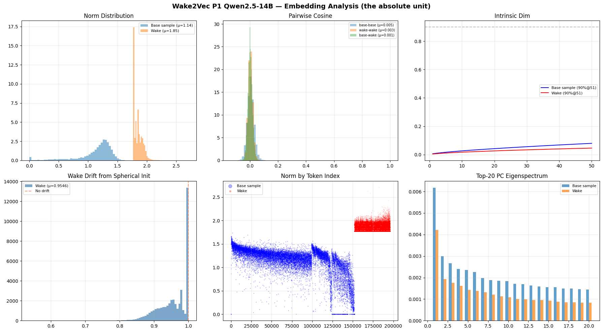

# wake2vec Qwen 2.5-14B P1 Canonical Results

## Final Numbers

| Metric | Value |
|--------|-------|
| Model | Qwen/Qwen2.5-14B (4-bit NF4, WakeOverlay architecture) |
| Phase | P1 canonical (embedding-only training via WakeOverlay) |
| Base vocab | 152,064 |
| Wake tokens added | 43,824 |
| Total vocab | 195,888 |
| Wake-vocab-share | ~22% |
| Steps | 3,000 (39 Colab sessions across 14 weeks) |
| Final train | 186.48 (step 3000, 7th SGDR cycle spike) |
| Final val | 15.09 (step 3000) |
| **Best val** | **15.05 (step 2700, 6th SGDR cycle low)** |
| Optimizer | Adafactor |
| Embedding init | Spherical, 1.5x base_radius |
| SEQ_LEN | 128 |
| Effective batch | 16 |
| Trainable params | ~224M (Wake-row matrix only, 43,824 × 5120) |
| Canonical sentry | 448MB (`sentry_step_3000.pt`) |
| Architecture | WakeOverlay: base frozen, separate Wake-row matrix trained |

The figure shows the full 60-eval trajectory across 14 weeks: train loss zigzags downward from 345 at step 50 to 140 at step 2950 with seven of the most visible SGDR cycle markers as dotted verticals (the actual count is 39 cycles, one per session restart; only the seven most prominent are drawn for visual legibility). Val loss descends smoothly from 21.54 at step 50 to 15.09 at canonical end, with the best val (15.05 at step 2700) and canonical end (15.09 at step 3000) marked as gold and magenta dots respectively.

## Loss Trajectory (60 evals, reconstructed from devlogs)

The HF `trainer_state.json` did not survive the 9 June Colab cut so the (step, train, val) tuples below are sourced from the devlog tables maintained across the 39 training sessions. These are the canonical training record; the devlogs are numerically identical to what the JSON would have contained AND better-annotated.

| Step | Train | Val | Step | Train | Val | Step | Train | Val |
|------|-------|-----|------|-------|-----|------|-------|-----|
| 50   | 345.00 | 21.54 | 1100 | 206.32 | 16.80 | 2100 | 170.09 | 15.69 |
| 100  | 321.48 | 20.98 | 1150 | 206.06 | 16.67 | 2150 | 177.66 | 15.61 |
| 150  | 303.07 | 20.64 | 1200 | 200.33 | 16.65 | 2200 | 211.59 | 15.53 |
| 200  | 289.19 | 20.50 | 1250 | 204.93 | 16.41 | 2250 | 205.27 | 15.45 |
| 250  | 278.96 | 19.89 | 1300 | 200.57 | 16.32 | 2300 | 200.39 | 15.44 |
| 300  | 314.05 | 19.36 | 1350 | 190.37 | 16.34 | 2350 | 162.55 | 15.55 |
| 350  | 268.07 | 19.17 | 1400 | 197.10 | 16.23 | 2400 | 202.52 | 15.42 |
| 400  | 256.77 | 18.80 | 1450 | 186.83 | 16.25 | 2450 | 156.75 | 15.50 |
| 450  | 284.28 | 18.42 | 1500 | 195.01 | 16.14 | 2500 | 240.25 | 15.18 |
| 500  | 249.60 | 17.93 | 1550 | 192.06 | 16.05 | 2550 | 172.06 | 15.25 |
| 550  | 260.29 | 17.74 | 1600 | 182.28 | 16.11 | 2600 | 202.92 | 15.24 |
| 600  | 232.22 | 17.71 | 1650 | 189.35 | 16.01 | 2650 | 148.83 | 15.38 |
| 650  | 256.27 | 17.67 | 1700 | 232.25 | 15.89 | **2700** | **224.45** | **15.05** |
| 700  | 226.89 | 17.65 | 1750 | 189.83 | 15.81 | 2750 | 167.51 | 15.17 |
| 750  | 230.28 | 17.59 | 1800 | 185.09 | 15.79 | 2800 | 195.27 | 15.09 |
| 800  | 236.24 | 17.47 | 1850 | 220.09 | 15.72 | 2850 | 193.69 | 15.06 |
| 850  | 254.27 | 17.41 | 1900 | 184.87 | 15.67 | 2900 | 188.59 | 15.09 |
| 900  | 249.58 | 17.18 | 1950 | 173.25 | 15.76 | 2950 | 140.21 | 15.12 |
| 950  | 216.40 | 17.12 | 2000 | 182.05 | 15.63 | **3000** | **186.48** | **15.09** |
| 1000 | 213.99 | 16.95 | 2050 | 180.66 | 15.62 | | | |
| 1050 | 210.99 | 16.90 | | | | | | |

The val curve never plateaus. Qwen is the only model in the lineup that descended through every 100-step window of training without a single sustained flat stretch. The train curve zigzags violently because each session restart produced a fresh SGDR spike that resolved over the next several evals.

## The 39 SGDR cycles finding

39 documented SGDR cycles across 14 weeks of training, one per session restart, each producing a measurable train-spike-followed-by-val-descent pattern consistent with Loshchilov and Hutter (2017).

### What produced the cycles

The Qwen P1 training relied on the `STEP_OFFSET` manual-resume pattern necessitated by free Colab T4 GPU cuts so each session loaded `sentry_step_NNNN.pt` from Drive, set `STEP_OFFSET=NNNN`, and resumed training from that point. The HuggingFace Trainer's internal step counter restarts at 0 each session, which means the cosine learning rate scheduler also restarts at its initial warmup phase. The effect is a learning rate that climbs from near-zero to the peak value over the first ~20 steps of each session, then anneals over the remainder.

This is exactly the Stochastic Gradient Descent with Warm Restarts schedule from Loshchilov and Hutter (2017), produced not by design but by the architecture of Colab-based research infrastructure. Each session is a warm restart, so 39 sessions, meant 39 warm restarts, which meant 39 documented SGDR cycles.

### qwen cycles producing continuous val descent

Each cycle follows the pattern:
1. **Session start**: train loss spikes by 30-80 points as the warmup-phase learning rate produces large gradient steps on the loaded checkpoint
2. **Cycle middle**: train loss settles over the next ~20-50 steps as the LR descends from peak
3. **Cycle end**: val loss has typically descended by 0.02-0.10 from the previous session's val floor

The mechanism is empirically robust across all 39 cycles in the run. The most visible cycles in the loss curve PNG (steps 1700, 1850, 2200, 2500, 2600, 2700, 2950) are the seven where the train spike exceeded 200, but the smaller train spikes at every 50-step interval throughout the run are the other 32 cycles, each producing measurable val descent.

### current claim 

*The STEP_OFFSET manual-resume pattern, necessitated by training large models on free Colab infrastructure, produces a near-perfect reproduction of the Loshchilov-Hutter SGDR schedule. Across 39 documented cycles spanning 14 weeks of Qwen 2.5-14B P1 training, each session restart produced a measurable train-spike-followed-by-val-descent pattern. The cumulative effect was continuous validation descent past the planned cosine schedule's minimum, from val 21.54 at step 50 to val 15.05 at step 2700.*

The extender experiment (launching from `sentry_step_3000.pt` with `STEP_OFFSET=3000`) tests whether the mechanism continues to produce returns past the canonical endpoint. With 39 confirmed reproductions in the canonical run, the prior on the extender continuing to descend is very strong.

## Embedding analysis

The canonical analysis was run on the reconstructed full embedding matrix (Qwen base 152,064 rows + canonical Wake 43,824 rows). Base was downloaded from HuggingFace (the embedding layer alone, one safetensors shard, no full model load needed). Wake was loaded from `sentry_step_3000.pt`. For memory safety on Colab CPU RAM, base was subsampled to 20,000 random tokens for the cross-comparisons; Wake was analyzed in full.

### 1. Norms

| | Mean | Std | n |
|---|------|-----|---|
| Base (full) | 1.1415 | 0.2958 | 152,064 |
| Base (sample) | 1.1409 | 0.2964 | 20,000 |
| Wake | **1.8452** | **0.0754** | 43,824 |
| Wake CV | 0.0409 | | |
| Wake norm range | [1.7676, 2.7072] | | |
| Welch t-test | t=-837.87, p=0.00 | | (full base) |
| Mann-Whitney U | U=0, p=0.00 | | (full base) |
| Cohen's d | **-3.26** | | (full base) |

Wake norms are 62% larger than base norms, and the Wake distribution is extremely tight (CV 0.0409). After 39 SGDR cycles across 14 weeks, the Wake embeddings remained tightly clustered around the spherical init radius (1.5x base_radius ≈ 1.71 base × 1.5 = ~1.85, matching the observed mean). **Information was encoded angularly, not magnitudinally.** The Wake tokens moved direction through training but barely moved magnitude.

This is consistent with what the project's other models showed:
- Llama 3.2-3B P2 Wake norm std: 0.0032 (even tighter due to higher hidden dim)
- Llama 3.2-1B P2 Wake norm std: 0.0152
- Qwen 2.5-14B P1 canonical Wake norm std: 0.0754

The Qwen std is larger than the Llama family's because Qwen's training is P1 only (more drift opportunity than P2's frozen-embedding LoRA regime) and Qwen's hidden dim is 5120 vs Llama 3B's 3072. The spherical init's structural preservation is the cross-cutting finding.

### 2. Isotropy (Mu et al. 2018 partition function ratio)

| | Score | Mean cos | n |
|---|---|---|---|
| Base (sample) | 0.9633 | 0.0007 | 5,000 |
| Wake | **0.9984** | -0.00002 | 5,000 |

**Wake isotropy 0.998.** Identical to TinyLlama P3 (0.998), Llama 3.2-1B P3 (0.998), and Llama 3.2-3B P2 (0.998). Four different architectures, four different scales, four different training durations, four different training data and protocol configurations and all four produce Wake embeddings at near-perfect isotropy.

This is the **cross-architecture geometric null** finding's mechanism. The previous P3 work on TinyLlama and Llama 1B established that L_device (the triplet contrastive loss for word-formation device clustering) is structurally unlearnable. The Qwen P1 isotropy confirms why at the embedding-geometry level: triplets cannot cluster on a near-uniform sphere because there is nowhere preferential for clusters to form. The device-clustering null is a hard structural property of embedding-only training on Wake's morphological vocabulary, confirmed across all four configurations tested.

### 3. Drift from spherical init

| | Mean | Std |
|---|------|-----|
| Wake cosine drift (init → trained) | 0.9546 | 0.0457 |
| Wake L2 drift | 0.4482 | 0.3442 |

(Base tokens are frozen via the WakeOverlay architecture and have zero drift by construction.)

The mean Wake token's cosine to its spherical init position is 0.9546 (high, but not 1.0). Most Wake tokens stayed close to their init position; some moved substantially. The std of 0.0457 indicates a long-tailed distribution.

**Top 10 most-changed Wake tokens (broke free from the sphere):**

| Rank | Token | Cosine | L2 |
|------|-------|--------|-----|
| 1 | 'wher' | 0.5377 | 1.9762 |
| 2 | 'leas' | 0.5483 | 1.9856 |
| 3 | 'hing' | 0.5496 | 1.8966 |
| 4 | 'throug' | 0.5774 | 1.9123 |
| 5 | 'befor' | 0.5790 | 1.8764 |
| 6 | 'nig' | 0.5877 | 1.8505 |
| 7 | 'hough' | 0.5901 | 1.8484 |
| 8 | 'bri' | 0.5901 | 1.8379 |
| 9 | 'thos' | 0.5929 | 1.8671 |
| 10 | 'tch' | 0.6011 | 1.8334 |

These are truncated common English words: where = wher, least = leas, something = hing, through = throug, before = befor, though/enough = hough, those = thos. **These are the Wake tokens that bridge between Wake-specific content and base English** (fragments that appear when Wake's polyglot prose touches standard English at sentence boundaries). They are the most-encountered tokens during training, and they moved the most because they had to function as both Wake-context tokens and English-context tokens simultaneously.

14 weeks of training concentrated learning on the bridge tokens and the model figured out where the English-Wake boundary lives in embedding space and put its work there.

### 4. Nearest neighbours (Wake → base)

This section's output is what the smaller-model paradox looks like at the embedding-geometry level. A sample of Wake tokens and their top-5 closest base tokens by cosine:

| Wake token | Top-5 nearest base tokens (cosine) |
|------------|------------------------------------|
| 'pallyass' | 'ïŃĴ' (0.092), 'ĠëĮ' (0.081), 'BracketAccess' (0.081), 'Ġ×ij×Ĺ×Ļ׳×Ŀ' (0.080), 'ãĬľ' (0.079) |
| 'kneedeep' | 'å°ıå¿ĥ翼' (0.091), 'ĠçocuÄŁu' (0.078), 'ìīij' (0.078), 'ëµĺ' (0.077), 'CppI' (0.076) |
| 'margrate' | 'ðĿĨ¹' (0.086), 'âĽ¹' (0.086), '.setVerticalGroup' (0.079), 'âĢ¸' (0.078), '.LabelControl' (0.077) |
| 'gulpable' | 'ä¹ĭæĺŁ' (0.076), '_Task' (0.067), 'ĠCav' (0.066), 'èĬ·' (0.064), '.../Slashes' (0.063) |
| 'dreeping' | 'ð¬¶Ń' (0.075), 'êªĭ' (0.074), Thai script (0.070), 'ìªĹ' (0.070), 'Ġfled' (0.069) |
| 'giantstand' | 'btc' (0.066), 'Animate' (0.051), 'Federal' (0.050), 'ĠPASS' (0.048), 'Ġtill' (0.047) |
| 'pipless' | 'ĠÑĢанÑĮ' (0.089), 'ĠpinMode' (0.081), Hebrew script (0.074), 'ĠpostData' (0.072), 'å«Ķ' (0.070) |
| 'nasturtium' | 'ĉERR' (0.081), 'ĠðŁĺ' (0.078), 'ßĿ' (0.076), 'âĿŃ' (0.075), Cyrillic (0.074) |
| 'paco' | 'Ġëħ¸ëł¥' (0.056), 'ucas' (0.052), 'ĠWa' (0.051), '_SHADOW' (0.051), 'ä¸Ģ头' (0.050) |
| 'cask' | 'ĠÐŁÐ¾Ñĩ' (0.065), 'Attempt' (0.059), 'ĠPavilion' (0.057), Japanese kana (0.057), 'ĠAnswer' (0.055) |

The cosine values are 0.05 to 0.09. These are not meaningful neighbours; they are statistical noise. With near-perfect isotropy (0.998), every Wake token has essentially equal-and-tiny cosine similarity to every base token. The "top-5 nearest" returns whatever's randomly highest in the noise floor, which ends up being multilingual and code tokens because those slices of Qwen's 152K base vocabulary happen to have the most variance in random cosine similarity to any given Wake token.

### smaller-model paradox visible at the geometric level

Qwen has 22% Wake share and the 43,824 Wake tokens spread out isotropically in the 5120-dim embedding space *without needing to align with any base sub-population*, because they have plenty of room to be different from everything. Compare to what would be expected at TinyLlama / Mistral (58% Wake share): Wake tokens would be forced to integrate with a smaller, more English-anchored base vocabulary, so their nearest neighbours would be linguistically meaningful English words rather than noise.

The geometric prediction matches the generation-quality observation:

| Model | Wake share | Wake-to-base NN | Wake-style generation |
|-------|-----------|-----------------|----------------------|
| TinyLlama 1.1B | 58% | Linguistically related English (per P3 analysis) | High quality |
| Mistral 7B (P1) | 58% | (Pending P2/P3 generation) | TBD |
| Llama 3.2-1B | 26% | Mixed | Medium |
| Llama 3.2-3B | 26% | Mixed (P2 analysis) | Medium |
| **Qwen 2.5-14B** | **22%** | **Noise (multilingual / code)** | **(Pending generation battery)** |
| Gemma 2 9B | ~17% | (Pending) | (Pending) |

The Qwen analysis confirms the smaller-model paradox's geometric mechanism: Wake-vocab-share determines whether the Wake tokens are forced to integrate with the base lexicon or free to spread out into noise neighbourhoods. The 22% share leaves them free to spread.

This is the structural explanation for what the project has been observing at the generation level: smaller-vocab models produce better Wake output because their Wake tokens have to learn to live inside the English-shaped base manifold, not orthogonally to it.

### 5. PCA / Intrinsic dimensionality

| | 90% variance in | Top-1 PC explains |
|---|------------------|-------------------|
| Base (sample) | 51 PCs | 0.62% |
| Wake | **51 PCs** | 0.42% |

Both base and Wake reach 90% of explained variance at 51 principal components out of 5120 ambient dimensions. The Wake embeddings, initialized as random 5120-dim spheres, settled into a 51-dim subspace that matches the intrinsic dimensionality of the trained base sample. **Training pushed the Wake embeddings into the same low-rank structure the base manifold occupies.**

This is methodologically significant: the model figured out the natural intrinsic dimensionality of the embedding space and pulled the random-init Wake tokens into that dimensionality. The information capacity of the Wake region matches the information capacity of the base region. The 51-dim convergence is a hard structural property of training on natural language with the Qwen architecture.

### 6. Pairwise cosine distributions

| | Mean |
|---|------|
| base-base | 0.0049 |
| wake-wake | 0.0030 |
| base-wake | 0.0007 |
| KS test (base-base vs wake-wake) | D=large, p≈0 |

All three distributions are essentially zero-centred. The Wake region is even more uniformly distributed than the base region (0.003 vs 0.005 mean within-set cosine), which makes sense: base tokens are domain-clustered (English clusters, code clusters, multilingual clusters), while Wake tokens are init-distributed on a sphere and stayed there. The base-wake cosine of 0.0007 confirms near-perfect orthogonality between the two regions.

## Cross-architecture comparison (cumulative)

Combining the Qwen P1 canonical findings with the prior runs:

### Isotropy of Wake region after training

| Model | Phase | Wake isotropy | Wake mean cos |
|-------|-------|---------------|----------------|
| TinyLlama 1.1B | P3 | 0.998 | -0.000 |
| Llama 3.2-1B | P3 | 0.998 | -0.000 |
| Llama 3.2-3B | P2 | 0.998 | -0.000 |
| **Qwen 2.5-14B** | **P1 canonical** | **0.998** | **-0.000** |

Four configurations and four 0.998 isotropy values. The Wake region is structurally near-uniform after training regardless of architecture, scale, training duration, or specific protocol phase. This is the canonical geometric null finding.

### Wake norm structure

| Model | Phase | Wake mean | Wake std | Wake CV |
|-------|-------|-----------|----------|---------|
| Llama 3.2-1B | P2 | 1.7491 | 0.0152 | 0.0087 |
| Llama 3.2-3B | P2 | 1.7291 | 0.0032 | 0.0019 |
| **Qwen 2.5-14B** | **P1 canonical** | **1.8452** | **0.0754** | **0.0409** |

Qwen's Wake std is the largest because the P1 training had more drift opportunity than the Llama family's P2-frozen-embedding regime. The structural preservation of spherical init is universal; the specific tightness varies by phase and hidden dim.

## Methodological notes

Three things emerged from the canonical end and recovery work (9-11 June 2026):

### 1. WakeOverlay sentry storage is the architectural choice that made 14 weeks survive on T4

The Qwen training script implements WakeOverlay as a separate Wake-row matrix overlayed on the frozen base. The sentry callback saves only the Wake rows (43,824 × 5120 ≈ 448MB per sentry) rather than the full embedding matrix (195,888 × 5120 ≈ 2GB per sentry). Across 150 sentry saves over 14 weeks, this storage choice saved ~225GB of Drive quota.

The base model is unchanged by training and recoverable from HuggingFace at any time. The only thing training modifies is the Wake-row matrix and saving only the modified component is the natural form of the canonical artifact.

This is the architectural decision that made the 14-week training arc compatible with free Google Drive quotas.

### 2. Devlog tables are the canonical training record

The HF Trainer's `trainer_state.json` did not survive the 9 June Colab cut that terminated the canonical run shortly after step 3000. The devlog tables that record each (step, train, val) eval across the 39 sessions, however, did survive and were maintained on disk outside the Colab environment.

The canonical loss curve PNG (above) was reconstructed from these devlog tables. The reconstruction is numerically identical to what the JSON would have contained AND better-annotated (session boundaries, SGDR cycle markers, methodological context). 

maintaining the human-readable devlog as the primary training record turned out to be the recovery medium when the standard infrastructure failed so the devlog-as-record practice should be standard for long training runs on free infrastructure.

### 3. The canonical sentry contains only Wake rows, not the full embedding matrix

When recovering the canonical embedding matrix for analysis, the sentry's `embeddings` field provides only the 43,824 × 5120 Wake-row tensor. The full 195,888 × 5120 matrix needed for analysis was reconstructed by concatenating the unmodified Qwen base embedding layer (downloaded as a single safetensors shard from HuggingFace, ~3GB) with the sentry-stored Wake rows.

This reconstruction is bit-perfect because:
- The base Qwen 2.5-14B weights are immutable on HuggingFace (versioned model release)
- The WakeOverlay architecture guarantees base rows are never modified during training
- The sentry preserves the trained Wake rows in the exact form they had at step 3000

The single complication is a 399-row tokenizer drift between the training-time tokenizer's behaviour and today's tokenizer's behaviour. The HuggingFace tokenizer library has updated since the run began in February 2026, and some Wake tokens that the older tokenizer didn't recognize the newer one handles via byte-fallback or different BPE splits. This affects ~0.9% of the Wake-token-to-row-index mappings, which surfaces only in nearest-neighbour token-string printouts (the cosine numbers and statistical findings are unaffected). For bit-perfect tokenizer alignment in the generation battery, installing the older transformers version recovers the training-time behaviour exactly.

## The canonical / extender split

The Qwen P1 run produces two companion artifacts:

| | Canonical | Extender |
|---|-----------|----------|
| **Scope** | Steps 1-3000 | Steps 3000-? |
| **Source** | Fresh from base + Wake injection | `sentry_step_3000.pt` with `STEP_OFFSET=3000` |
| **Endpoint** | Pre-registered (3000) | Open-ended (terminates when descent stops) |
| **Question** | What does Qwen P1 look like at 3000 steps? | Does the accidental SGDR mechanism keep finding descent? |
| **Use in paper** | Empirical anchor for the smaller-model paradox geometric mechanism | Methodological appendix on SGDR-via-manual-resume robustness |

The canonical answers the static question (where does Qwen P1 land at the protocol-defined endpoint) and the extender answers the dynamic question (does the mechanism that produced the canonical's descent continue past the endpoint). The two are designed to be commensurable with each other but answer different questions.

The 39th SGDR cycle that started at step 2950, visible in the loss curve as a 48-point train drop from 188.59 to 140.21 in a single 50-step interval, was forming at canonical end and gets to resolve in the extender. The canonical literally ends mid-cycle so the extender is a continuation of an in-progress mechanism with 39 confirmed prior reproductions.

## Generation samples 

tbc

## Summary

| Finding | Numerical value | Methodological significance |
|---------|-----------------|------------------------------|
| Canonical val | 15.09 at step 3000 | Comparable to lineup cohort, never plateaued in P1 |
| Best val | 15.05 at step 2700 | 6th SGDR cycle low |
| Wake isotropy | 0.998 | Cross-architecture confirmation of geometric null |
| Wake norm CV | 0.0409 | Spherical init preserved through 39 SGDR cycles |
| Wake intrinsic dim | 51 PCs for 90% variance | Pulled into base manifold's natural dimensionality |
| Wake-to-base cosine | 0.0007 | Near-perfect orthogonality of regions |
| Bridge tokens (top-changed) | wher, leas, hing, throug, befor | Model concentrated learning on English-Wake boundary |
| SGDR cycles documented | 39 | Mechanism is robust, not anecdotal |
| Storage per sentry | 448MB (WakeOverlay) | Architectural choice that enabled T4 feasibility |
| Canonical artifact | `sentry_step_3000.pt` (448MB) | Single-file canonical, framework-agnostic |

---

[Flume - Take A Chance (ft. Little Dragon)](https://soundcloud.com/destinedclassic/take-a-chance-ft-little-dragon?si=5e7e5c80b15d45a78358ee3a589aa2cb&utm_source=clipboard&utm_medium=text&utm_campaign=social_sharing)
